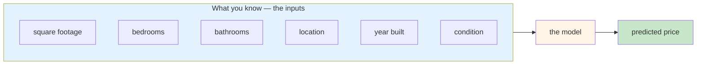
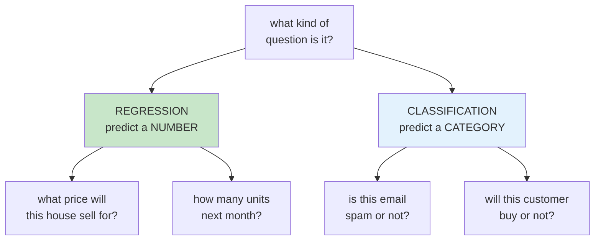
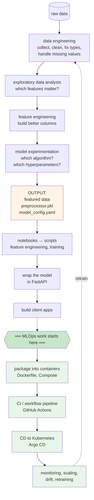
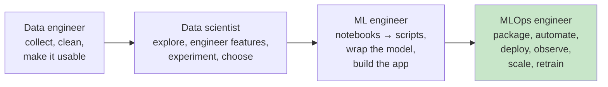
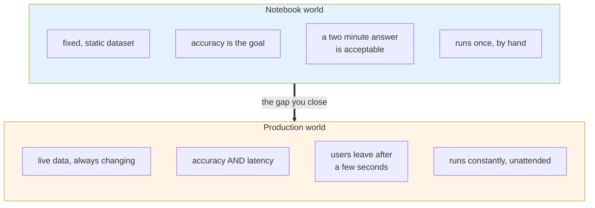
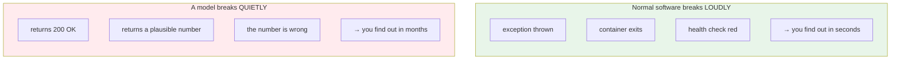
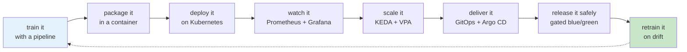

# The ML Lifecycle and the Project You Will Build

Before a DevOps engineer can be useful on a project, they need to know what the application does.
Which language, which build tools, how it is packaged, how it gets deployed.

MLOps is the same. You do not need to build models. You do need to understand how the people
around you work, so you can automate their workflow and follow the conversation in a meeting.

This module gives you the map. One problem, one project, and a clear line showing where your work
begins.

## What you'll learn

- Describe the house price prediction problem and why it is a regression task
- Walk the end-to-end machine learning lifecycle from raw data to a served model
- Identify which parts belong to the data scientist and which belong to you
- Name the point in the lifecycle where MLOps work actually begins

## The problem

You are predicting the price of a house.

Small dataset, simple problem, and close enough to a real application that everything you learn
transfers. There is even a web interface on top, so you can watch it work.

That last part matters more than it sounds. A course where the output is a number in a terminal
is much harder to stay interested in than one where you can open a page and get a price.

### Regression, not classification

Price is a continuous number, so this is a **regression** problem. That single fact decides which
algorithms are candidates and which scores are used to judge them.

## The lifecycle, and the line that matters

Here is the whole course in one picture. Find the dotted line.

Everything above the line is somebody else's job, and this course has you **understand** it,
module 3, not do it for a living.

Everything below the line is yours, and that is modules 4 through 10.

Notice the arrow looping from monitoring back to data engineering. That loop is the whole point
of the last two modules, and it is what separates a deployed model from an operated one.

## Who does what

:::note[These boxes are not walls]
In a small team one person does all four. In a large one there are separate teams. Developers do
DevOps work, and ML engineers do MLOps work.

The point of drawing the boxes is not to build silos. It is so you know whose problem you are
looking at, and who to talk to.
:::

## Why models need their own operations practice

A fair question: if this is just deployment and monitoring, why is there a separate discipline?

### Data scientists optimise for something different

A model can be excellent by every theoretical benchmark and useless in production because it
takes two minutes to answer. Nobody in the notebook world was measuring that. You are.

### Models fail without failing

This is the one to remember.

When the incoming data drifts away from what the model was trained on, the relationship it
learned no longer holds. It does not raise an error. It just predicts badly, confidently.

Nothing in a normal monitoring stack catches that, which is why **data drift** and **model
degradation** need their own tools and their own signals. You build exactly that in Module 10.

## What you will have built by the end

One repository, grown module by module. You fork it once in Module 2 and never start over.

:::tip[Your existing skills transfer more than you think]
If you already do DevOps, you are the expert here on containers, CI, Kubernetes and monitoring.
That is most of the boxes above.

What is new is a handful of ideas: models come with a preprocessor, experiments need tracking,
and failure can be silent. MLOps is an extension of what you already know, not a replacement for
it.
:::

## What comes next

Module 2 sets up your workstation and gets MLflow running.

Module 3 puts you in the data scientist's chair for one module, so the handover in Module 4 makes
sense.

From Module 4 onward you are on your own ground, and it stays that way to the end.
