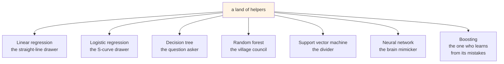
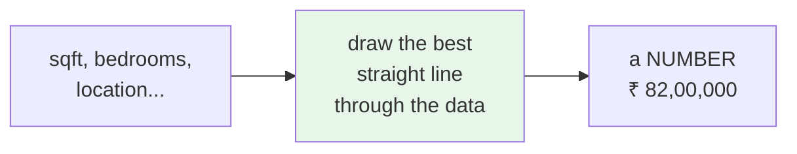
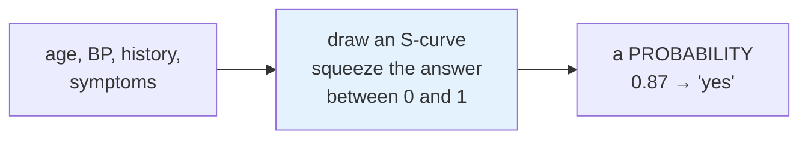
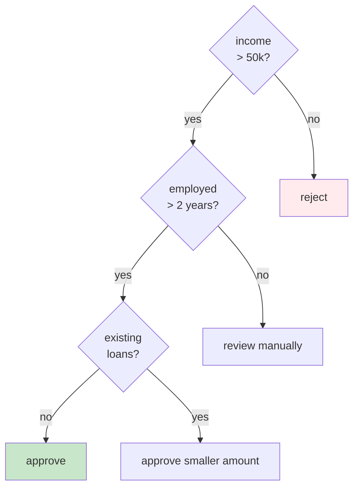
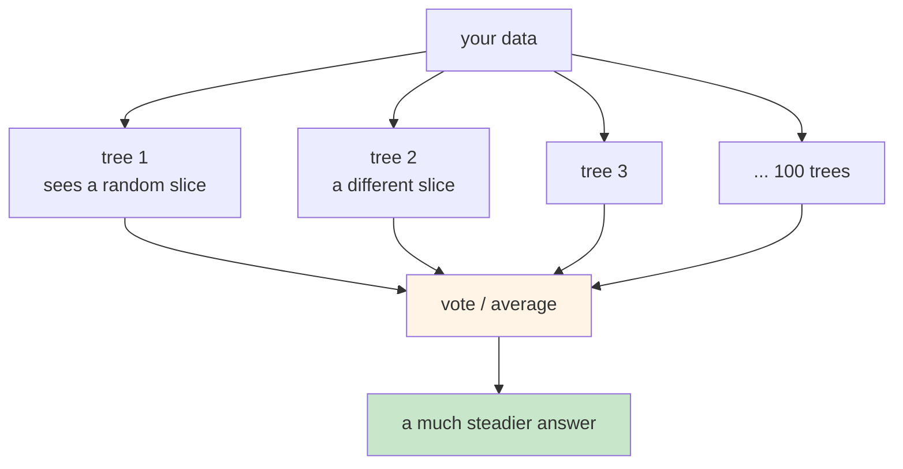
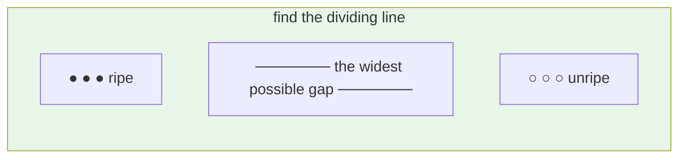
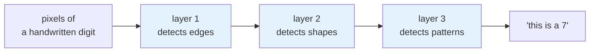
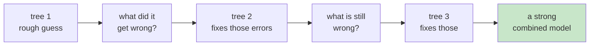
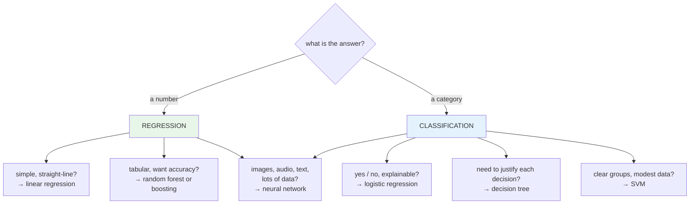

# ML Algorithms Explained with Analogies

Optional module. Read it whenever you like.

A **model** is nothing but an algorithm that has learned from your data, using certain features
and hyperparameters, and is ready to answer when you show it something similar. That act of
answering is inference.

You do not need to build these. You do need to recognise the names when they appear in
`model_config.yaml`, and to know roughly when each one is used. That is what this page gives you.

## The seven helpers

Think of it as a fairy tale land with different helpers. Each one solves a different kind of
problem.

## Linear regression — the straight-line drawer

**Priya wants to predict house prices in her neighbourhood.**

She notices something simple. Bigger houses cost more, and roughly in a straight line. Double the
square footage and the price roughly doubles.

**Use it when** the answer is a number and the relationship is close to a straight line. It is
fast, cheap and easy to explain, which is why it is often the first thing to try.

This is the algorithm behind the project you build in this course.

## Logistic regression — the S-curve drawer

**Doctor Vikram needs to predict whether a patient has a certain disease.**

He collects age, blood pressure, family history, symptoms and habits, and feeds them in. The
answer is not a number. It is yes or no.

Very similar to linear regression, with one change. Instead of a straight line it draws an S
curve, which keeps the output between 0 and 1 so you can read it as a probability.

**Use it when** the answer is a category, usually yes or no. Despite the name, it is
classification, not regression.

## Decision tree — the question asker

**Raj works at a bank and wants to approve consumer loans on the spot.**

You are in an electronics store, you want an expensive gadget, and there is somebody at a desk who
can approve a loan in minutes. How do they decide?

They ask a series of questions, and each answer leads to the next.

**Use it when** you need the reasoning to be explainable. You can print the tree and show somebody
exactly why they were rejected, which matters a great deal in lending, insurance and anything
regulated.

**The weakness:** a single tree memorises its training data easily. Which leads to the next one.

## Random forest — the village council

**Somebody in your family is advised to have major surgery.**

What do you do? You get a second opinion. Probably a third. Only then do you decide.

That is a random forest. Not one tree, but many, each trained on a slightly different slice of the
data, all voting.

The wisdom of a crowd. One tree can be badly wrong. A hundred of them, each wrong in a different
direction, average out.

**Use it when** you want strong accuracy without much tuning. It is a reliable default for tabular
data.

**The cost:** more trees means more accuracy and more compute. `n_estimators` is exactly this
trade-off, and it is one of the hyperparameters you meet in Module 3.

## Support vector machine — the divider

**Meera is building a conveyor belt that separates ripe fruit from unripe.**

She measures colour, weight and a few other properties. Then she needs a boundary: everything on
this side is ripe, everything on that side is not.

An SVM draws that boundary, and specifically the one with the **widest possible margin** between
the two groups. The wider the gap, the more confident it is about new fruit landing near the
middle.

**Use it when** you have clear categories and not an enormous amount of data. It gets slow on very
large datasets.

## Neural network — the brain mimicker

**Arjun wants to recognise handwritten digits.**

Everybody writes differently. Some cursive, some not. There is no simple rule that separates a 7
from a 1 across every person on earth.

Layers of simple units, loosely inspired by neurons. Each layer learns something slightly more
abstract than the one before, and the network works out the rules itself rather than being told
them.

**Use it when** the pattern is genuinely complex and you have a lot of data. Images, audio,
language.

:::note[This is the family that became LLMs]
Large language models are neural networks, grown enormous and trained on enormous text. When you
get to LLMOps, this is the branch of the family tree you are standing on.
:::

**The cost:** lots of data, lots of compute, and it cannot easily explain itself.

## Boosting — learning from its own mistakes

**An IPL franchise needs to predict player auction prices.**

Batting average, bowling figures, fielding, past form. Many factors, combining in ways that are
not obvious.

Boosting builds trees **one after another**, and each new tree focuses on what the previous ones
got wrong.

Random forest builds its trees **in parallel** and averages. Boosting builds them **in sequence**,
each correcting the last. That is the whole difference between the two families.

**XGBoost, LightGBM and CatBoost** are the well-known members. For tabular data they are usually
at or near the top.

**The setting to know** is `learning_rate`, which is how big a correction each tree makes. It is a
bit like eating. Go too fast and you finish quickly but do not digest it properly. Go slower and
you learn better, but it costs more time and compute.

## Picking one

| Algorithm | Answer | Reach for it when |
|---|---|---|
| Linear regression | number | relationship is close to a straight line |
| Logistic regression | yes / no | you want a probability, simply |
| Decision tree | either | the decision must be explainable |
| Random forest | either | solid accuracy, little tuning |
| SVM | category | clear groups, not huge data |
| Neural network | either | complex patterns, lots of data |
| Boosting | either | tabular data, accuracy matters most |

## Why this matters to you

You are not choosing these. A data scientist is.

But when you open `configs/model_config.yaml` in Module 3 and see `gradient_boosting` with an
`n_estimators` grid, you now know what is being tuned and what it costs.

And the choice is **operational**, not only statistical. A neural network needs far more compute
than a linear regression. A random forest with 500 trees uses more memory than one with 50. Those
decisions land on your infrastructure, and you are the one who has to size for them.
