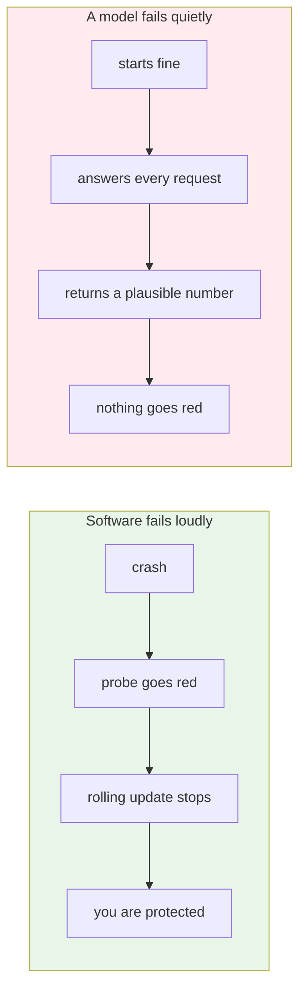
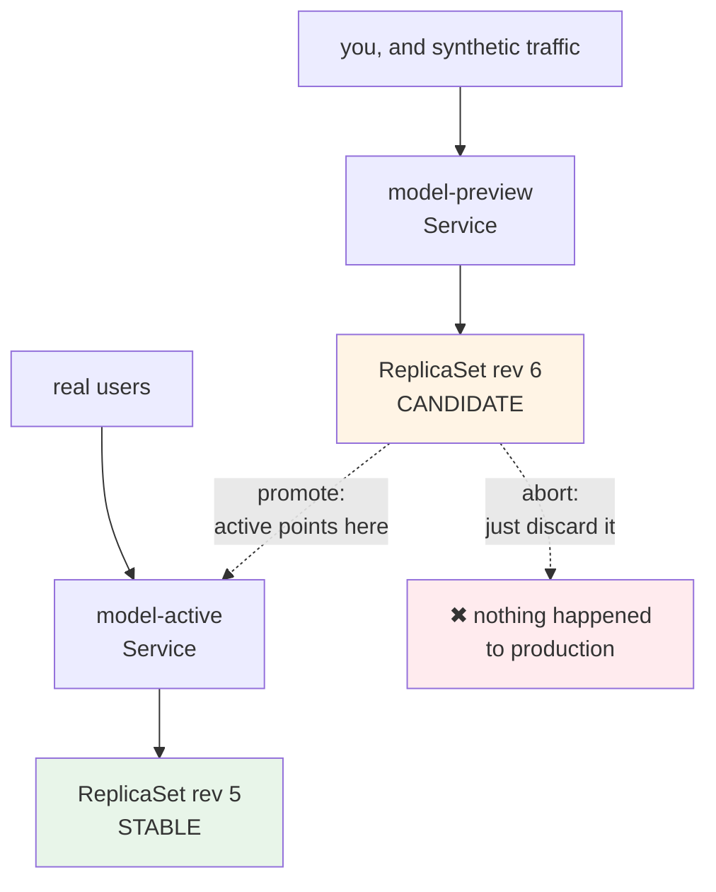
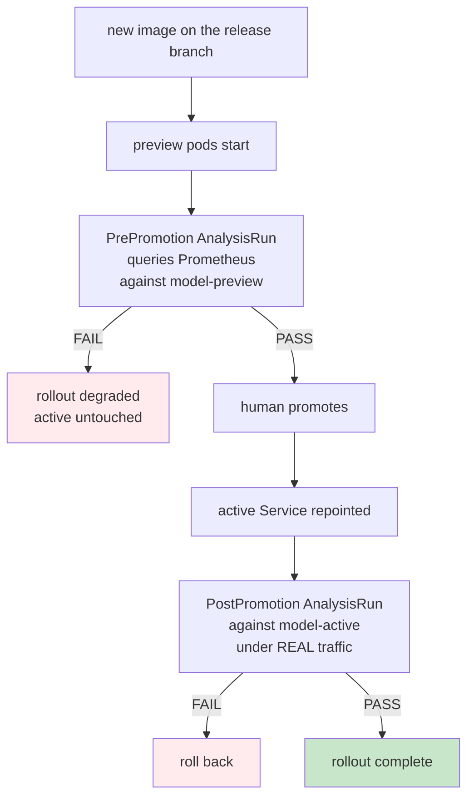
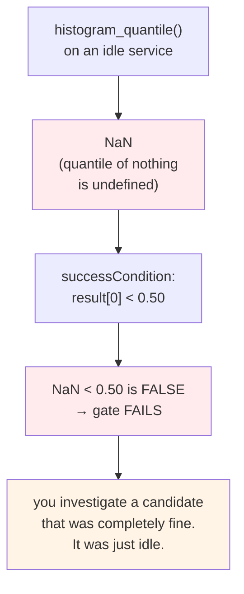
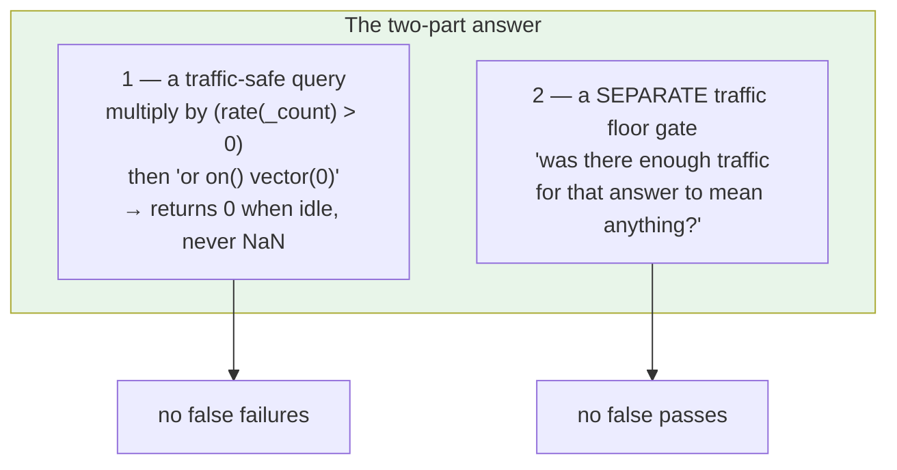
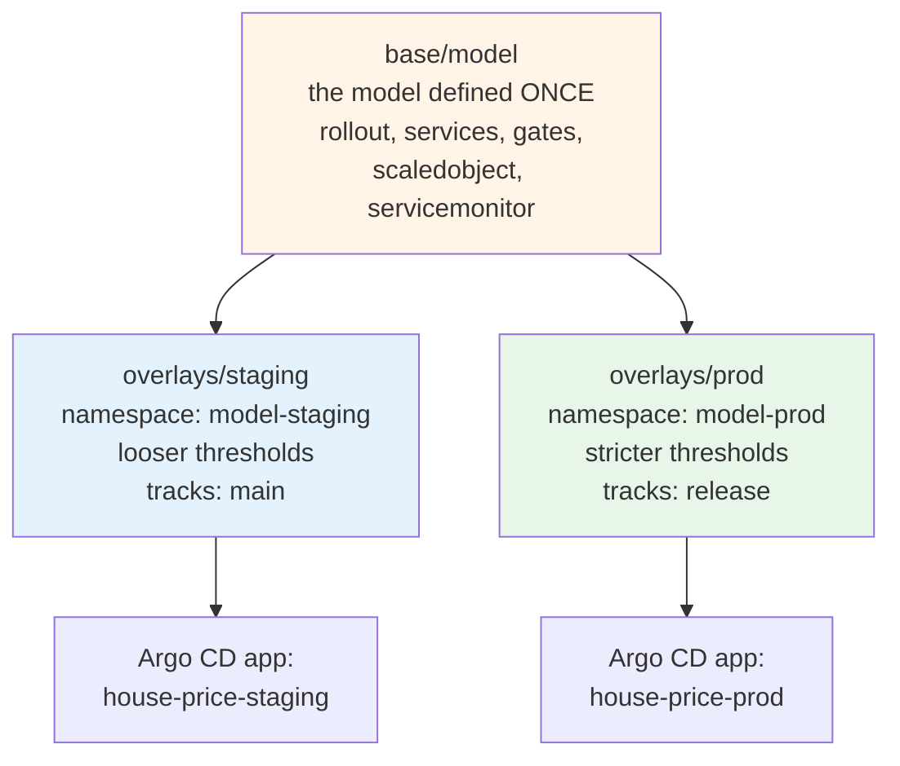
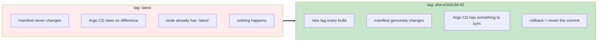

# Releasing Models Safely with Argo Rollouts

By the end of Module 8 you had a good deployment system. Push to the release branch, Argo CD
notices, the new version goes out.

For a web application that is enough. For a model it is not, and the reason goes back to something
from Module 1.



A rolling `Deployment` only knows whether the pod is alive. It has no opinion about whether the
answers are any good. This module replaces it with something that does.

## What you'll learn

- Explain why a Deployment cannot protect you from a model that fails quietly
- Run a candidate and the stable version side by side with an Argo Rollout
- Promote and abort explicitly, without a redeploy or a rollback
- Turn a Prometheus query into a pass or fail promotion gate
- Write PromQL that stays honest when traffic is low or absent
- Run staging and production from one set of manifests with kustomize overlays

## Blue/green, in one picture



Both versions run at once. Only one gets real traffic. Promotion is the moment the active Service
is repointed.

The important consequence: **aborting is not rolling back**. There is nothing to undo, because
the candidate never served anybody. You simply discard it.

:::tip[The setting that makes this worth doing]
`autoPromotionEnabled: false`.

Set it to `true` and the Rollout promotes as soon as the preview pods are healthy, which puts you
straight back where you started. Healthy is not the same as correct.
:::

## From looking at it, to measuring it

Running two versions is only half the answer. Somebody still has to decide.

In the first lab, that somebody is you, and you make the call by opening the preview and looking.
That does not scale, and it does not work when there are twenty models.

So the second lab hands the judgement to Prometheus.



Both halves earn their place. Pre-promotion asks whether the candidate is healthy before users
reach it. Post-promotion asks whether it is still healthy now that they have, because synthetic
traffic is never quite like the real thing.

## The problem that makes people give up on gates

This is the most valuable thing in the module, so it is worth slowing down.

The obvious latency gate is the same query from your Grafana dashboard:

```
histogram_quantile(0.95, sum by (le) (rate(http_request_duration_seconds_bucket[2m])))
```

Run it against an idle service and you get `NaN`.



This is why metric gates get abandoned. They cry wolf exactly in the environments where they
matter most, which is staging, where traffic is thin.

Now the trap on the other side. Guard against `NaN` by defaulting to zero, and an idle service
reports a latency of zero, which passes. **A completely dead service now passes your health
check.**

So you need two things at once.



Reading the guard from the inside out: `sum(rate(..._count[2m])) > 0` produces a sample only when
traffic exists. Multiplying by it with `on() group_left()` makes the whole expression empty when
there is none. Then `or on() vector(0)` supplies a zero.

:::note[A gate that cannot see should refuse to pass]
When you delete the synthetic traffic CronJob, the latency gate passes, because it falls back to
zero. The traffic floor gate fails, and the promotion is blocked.

That is the correct behaviour. The system is saying it cannot make a judgement, rather than
waving things through.
:::

## Staging needs traffic before any of this works

Preview pods receive nothing, because no user knows they exist. So you generate a small amount of
synthetic traffic on a schedule.

Two details in that CronJob are deliberate:

- **It calls `/health`, not `/predict`.** Fabricated predictions would pollute the prediction
  distribution, and that same distribution is what Module 10 uses to detect drift. You would be
  manufacturing your own false drift signal
- **It marks requests with an `X-Synth: 1` header**, so real and synthetic traffic can be told
  apart in the metrics later

## One model, two environments

The third lab splits the system in two without duplicating a single manifest.



A **base** defines the system once. An **overlay** layers environment-specific changes on top. The
model definition exists in exactly one place.

The single most important difference between the two overlays is `targetRevision`. Staging follows
`main`, so anything merged appears there within minutes. Production follows `release`, so nothing
arrives without a pull request.

Your approval step from Module 8 is now a real boundary between two real environments.

## Stop deploying `latest`

Module 8 left you with a bug you worked around. Here you fix it.



Three things follow from a unique tag. Every running pod traces to one commit. Every release is a
real change. And rollback is deterministic, because the previous tag still exists in the registry.

## Two traps worth naming

**KEDA cannot scale a Rollout without extra permission.** Its service account was never granted
access to `argoproj.io` resources. Nothing logs a clear error at the ScaledObject level.

The general rule: whenever a custom resource replaces a built-in one, anything that used to scale
or watch it needs its RBAC updated, and it fails silently.

**Ad-hoc restart patches cause churn.** Forcing a rollout with a timestamp patch creates a new pod
template hash, a new ReplicaSet, and with `selfHeal` running you get endless replacement nobody
can explain. Use one explicit annotation you bump on purpose.

## What you should have at the end

- the model running as a Rollout with active and preview Services
- a candidate promoted, and another aborted with production untouched
- three gates: p95 latency, 5xx rate, and a traffic floor
- a deliberately slow model stopped by the gate, with the AnalysisRun proving it
- staging and production from one base, tracking different branches
- images tagged with the commit SHA
- a release runbook written down

Your gates now measure whether the service is fast and whether it errors. They say nothing about
whether the model is still **right**. That is Module 10.
