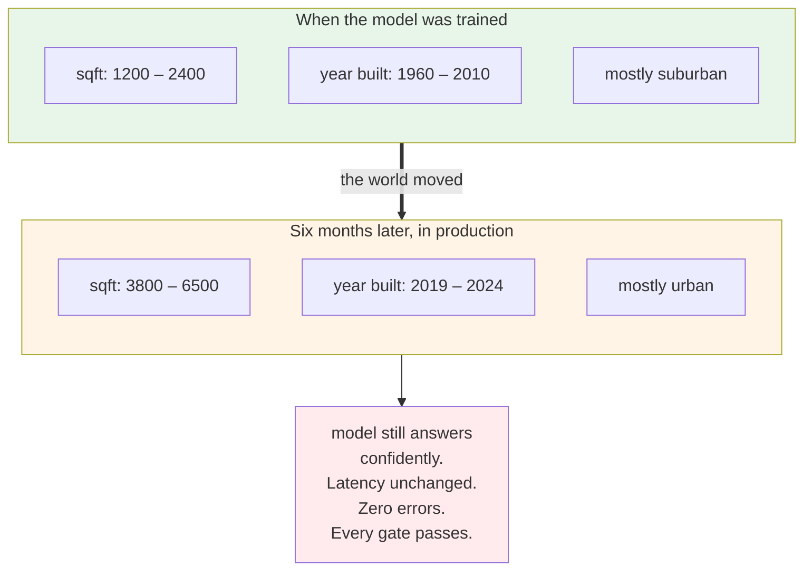
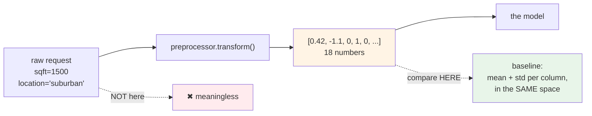
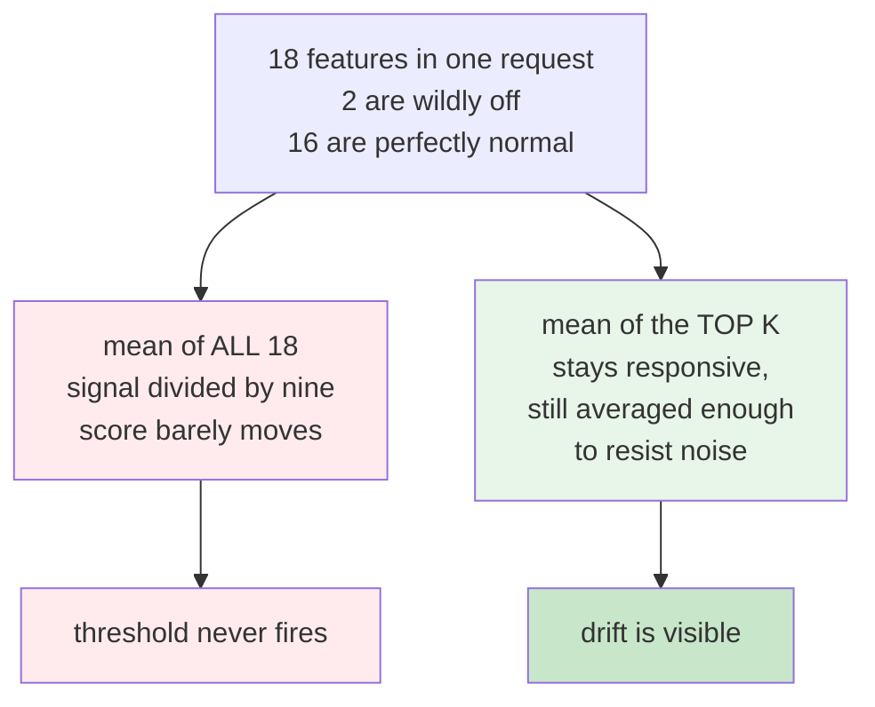
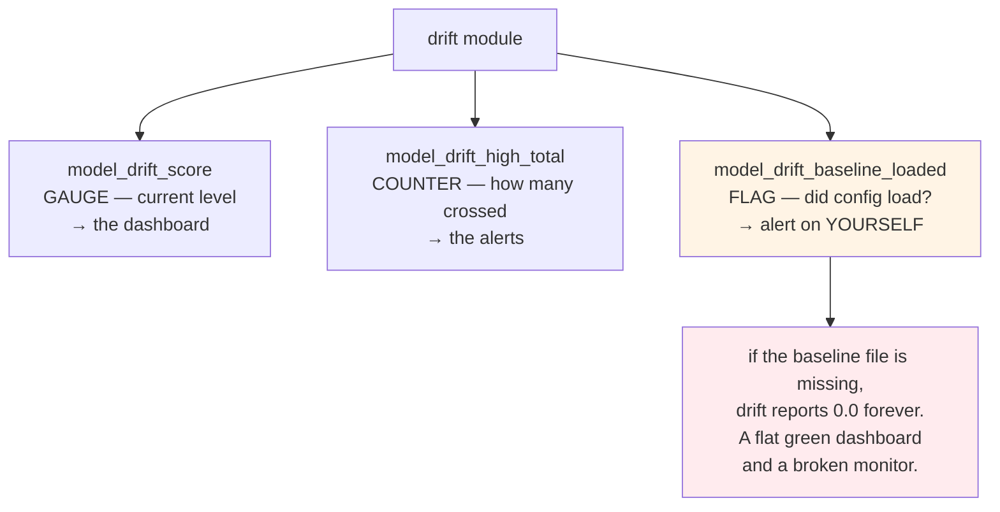
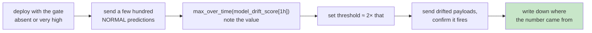
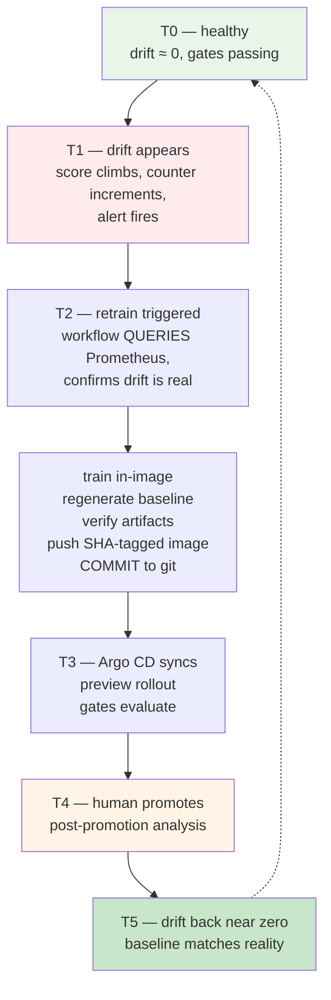
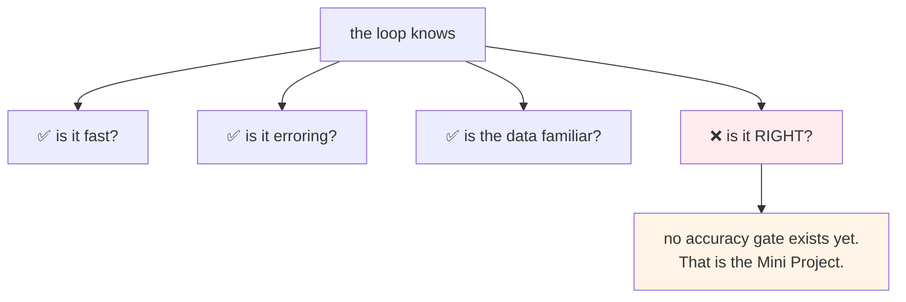

# Drift Detection and Automated Retraining

Every check you have built measures the **service**. Is it fast, is it erroring, is anyone calling
it. All three can be green while the model is quietly wrong.

Models do not fail like software. They fail like a weather forecast written for last year. The
code is fine. The numbers look reasonable. But the houses arriving are no longer the houses the
model learned from, and nobody notices for months.

## What you'll learn

- Describe data drift and why every service-level check misses it
- Capture a baseline in the transformed feature space, and explain why the raw space is wrong
- Score requests with z-scores and export drift as Prometheus metrics
- Alert on your own instrumentation being broken, not only on what it measures
- Trigger retraining from evidence rather than from a schedule
- Trace one full cycle from drift through retrain to a promoted model

## What drift actually looks like



The only way to see this is to measure the shape of the incoming data and compare it against the
shape you trained on.

## The baseline has to live in the right space

This is the part that is easy to get subtly wrong.



Your model never sees `sqft = 1500`. It sees whatever comes out of `preprocessor.transform()`, a
vector of scaled numbers and one-hot columns. That is the space it learned in, so that is the
space the baseline must describe.

:::warning[This duplication is a real weakness]
The baseline script repeats the feature engineering from the training path, and the two must match
exactly. If they drift apart, your drift score measures the difference between your own two code
paths rather than anything about the data.

That is **training and inference feature parity**, and it is one of the most common causes of
silent model failure. The lab's exercise asks you to fix it properly.
:::

## Scoring a request

The measure is the **z-score**, which is nothing but how many standard deviations a value sits
from the mean.

```
z = | (x − μ) / σ |
```

| z | Meaning |
|---|---|
| 0 | identical to the training mean |
| 1 | one standard deviation away, normal |
| 2 | a moderate shift |
| 3 | a strong anomaly |
| 5+ | far outside what the model learned |

### Why the top few, not the average of all



Most of a drifting request looks fine. Averaging everything buries the signal. Taking the top K
keeps it responsive without letting a single noisy value swing the result.

## Three metrics, and why the third one matters most



A gauge tells you the level now. A counter lets you ask "how many in the last five minutes" and
get a stable answer, which is why alerts use it.

The third is the one people leave out. If the baseline never loaded, the code does not crash. It
reports zero drift, forever, and that looks exactly like a healthy model.

:::note[The habit worth taking away]
**Alert on your own instrumentation being broken, not only on the thing it measures.**

Monitoring that cannot tell you when it is blind is not monitoring.
:::

## Alert on a ratio, not a count

Ten drifted requests out of ten matters enormously. Ten out of ten million does not.

Alerting on the raw count pages you every time traffic increases. The rules use a **ratio** of
drift-high requests to total predictions, averaged over a long window, with two levels: a warning
at sustained 5 percent and a critical at sustained 15 percent.

Drift is a slow phenomenon. The alerting should be slow to match, which is why both carry a
`for: 10m` so a brief spike pages nobody.

## Thresholds you must derive yourself



:::warning[A copied threshold is worse than no gate]
The right value depends on your feature count, your preprocessor and your training data. Copy a
number from somebody else's cluster and it will either never fire or always fire, and you will
stop trusting it either way.

The labs deliberately leave these unset and walk you through deriving them.
:::

## Closing the loop



Four things in that loop are worth naming.

**Retraining is gated on evidence.** The cron wakes up daily, but it only does work if Prometheus
confirms drift. Retraining on a schedule burns compute when nothing changed, and leaves you stale
when something did.

**Training happens inside the image** that will serve the model, so the library versions at
training and inference are identical.

**The baseline is regenerated in the same run.** Forget this and the new model immediately reports
massive drift against data it now handles perfectly well, and your own gates block a correct
release.

**The pipeline commits to Git. It never touches the cluster.** `kustomize edit set image` rewrites
the overlay, and the commit is the deploy trigger.

## Why a human still promotes

The loop stops short of full automation on purpose.

Automation should **propose**. A human should **approve**, for as long as the model affects real
outcomes. The gates already rule out the obvious failures, so the person is not checking latency
by hand. They are answering the question no metric can answer.

There is a practical argument too. Watch the loop fail a few times before trusting it unattended.
Observe, stabilise, then automate, in that order.

## The blind spot you should know about



There is a second blind spot, and it is subtler. After a retrain the drift score falls because
**the baseline moved**, not because the world went back to normal.

If the new data is genuinely the new normal, retraining was right. If it is an upstream system
sending garbage, you have just trained on garbage and told the model that garbage is normal. The
metric cannot tell those apart.

**A human still has to ask why the data changed.**

## What you should have at the end

- a baseline captured in the transformed feature space
- three drift metrics exported, including the baseline-loaded flag
- a Grafana panel and two alert levels on a ratio
- drift as a release gate, with your own derived threshold
- a retraining workflow that gates itself on a Prometheus query
- one full cycle observed: drift injected, retrain fired, new model promoted, drift normalised

That is the end of the build. What you have is not a collection of Kubernetes objects and
pipelines. It is a control loop, where every movement is measurable, every promotion is justified,
and every rollback is explainable.
