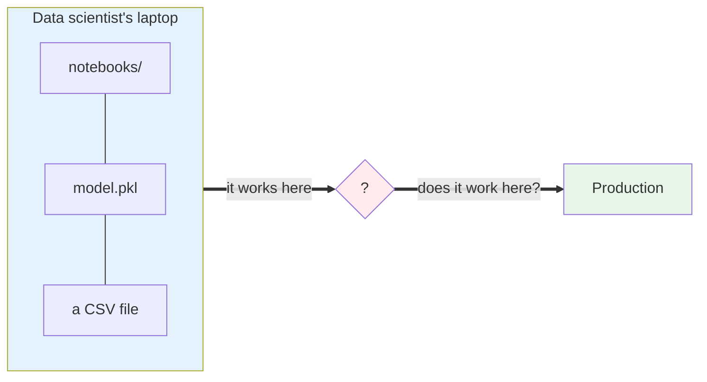
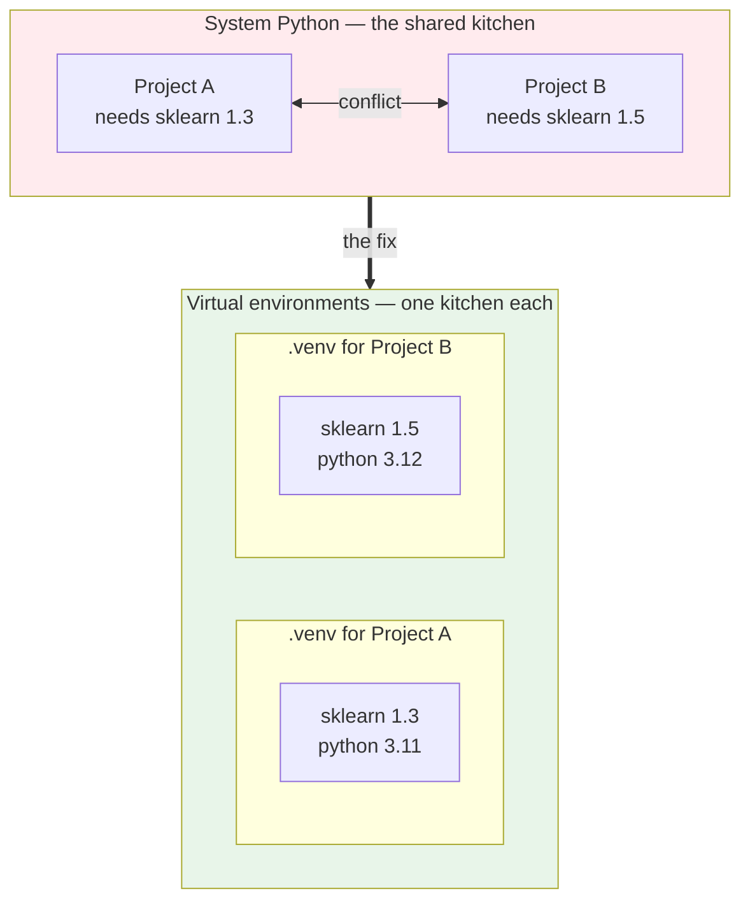
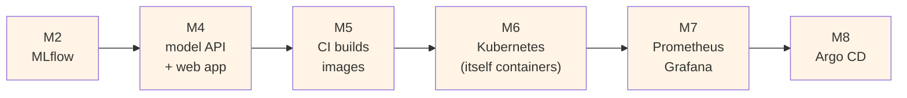
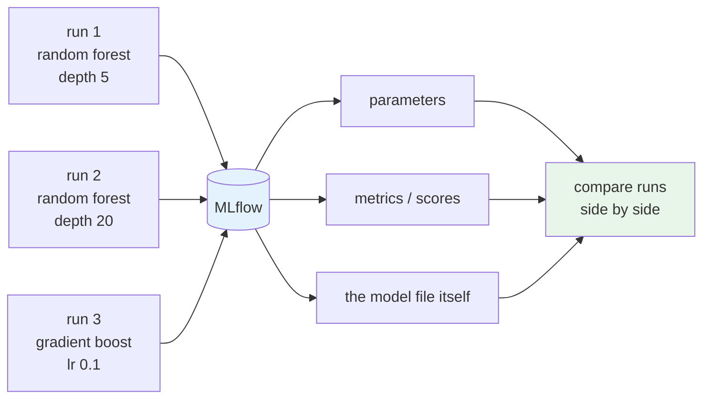
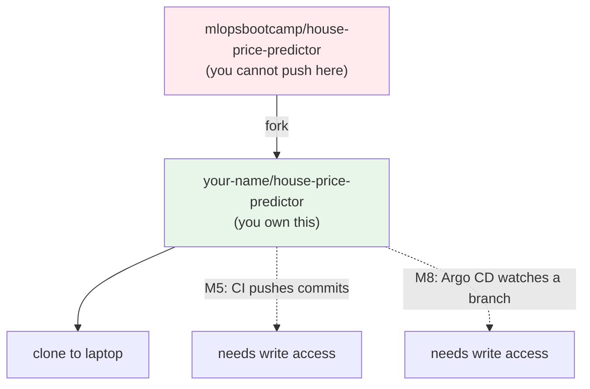
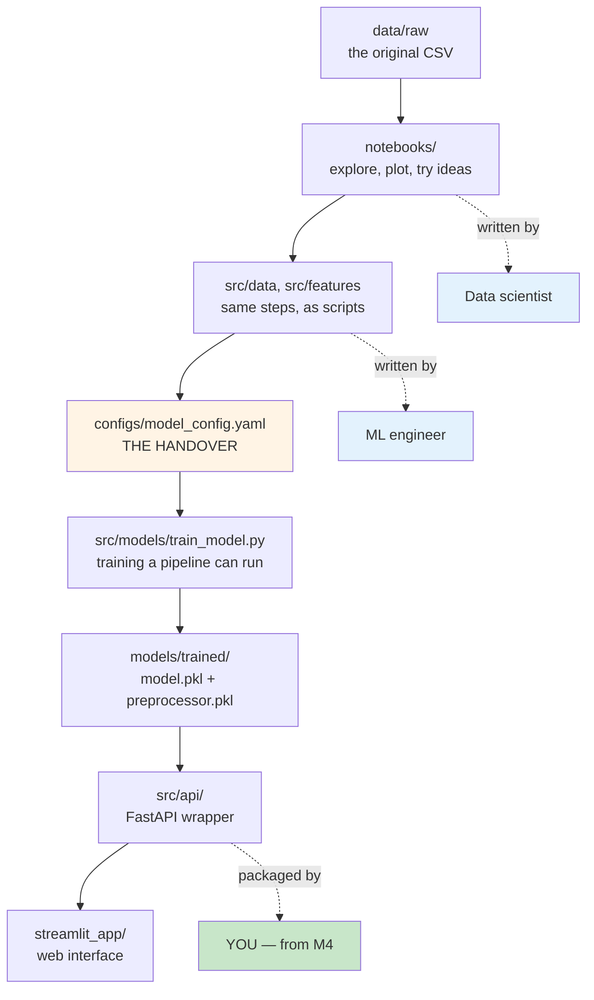
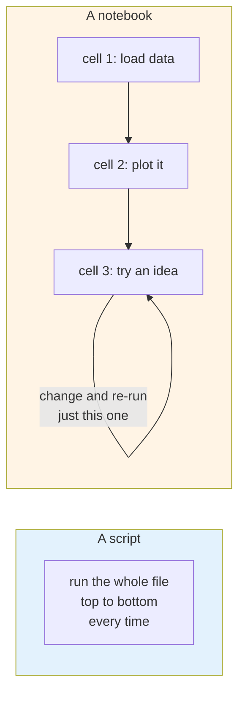

# Setting up your MLOps Workstation

Here is the situation you are walking into.

A data scientist on your team has built a model. It works on their laptop. They hand you a folder
with some notebooks, a CSV file, and a `.pkl` file. Then they ask you to put it into production.

Nobody wrote down which Python version they used. Nobody wrote down which version of
scikit-learn. The notebook imports six libraries you have never installed.

That question mark in the middle is your job. This module sets up the workstation you need
before you can start answering it.

## What you'll learn

- Create an isolated Python environment with uv
- Get a container runtime working on macOS, Linux or Windows
- Fork and clone the project repository, and explain why forking is required here
- Run MLflow as a container and reach its interface
- Navigate the project layout and explain the split between notebooks and scripts

## Why a virtual environment, and not just Python

Think of your system Python as a shared kitchen in a hostel. Everybody cooks in it. Somebody
leaves out an ingredient. Somebody swaps the salt for sugar. The dish you made last week does not
taste the same today.

A **virtual environment** is your own small kitchen. Your own shelf. Your own ingredients, in the
exact quantities you picked.

This matters more in machine learning than in most software. A model trained under one version
of a library may not load under another. **The library version is part of the model**, whether
anyone wrote that down or not.

You would use **uv** to create that environment. It does the same job as `venv` and `pip`. It
also does the same job as `conda`. It is just much faster. Installing the fifty or so packages
this project needs takes seconds instead of minutes.

That speed does not matter much on day one. It matters a lot later, when a pipeline rebuilds the
environment on every single commit.

Once the environment is active, `python --version` reports the version you pinned, not the one
your operating system happens to ship.

:::warning[The most common mistake]
If you open a new terminal tomorrow, you have to activate the environment again. Forgetting is
the number one reason a command that worked yesterday fails today. Look for `(.venv)` at the
start of your prompt. If it is not there, you are not in it.
:::

:::note[Already using conda?]
Keep using it. Nothing in this course depends on uv specifically. What matters is that the
environment is isolated and the versions are pinned.
:::

## Why containers appear in module 2, not module 6

You might expect containers to show up later, near the deployment sections. They show up now, and
there is a good reason.

Almost everything you are about to run is already a container.

Every single box there is a container. If your container runtime is not working, you would be
stuck in Module 2, not in Module 6. So you fix it now.

You have two reasonable choices. Which one you pick depends on whose laptop this is.

| | Docker Desktop | Podman Desktop |
|---|---|---|
| Personal machine | Fine, free | Fine, free |
| Company machine | **Licensing restrictions** | No restrictions |
| Commands | `docker ...` | same, or alias `docker` to `podman` |
| Compose | included | may need separate install |

On a work laptop, Podman is the safer choice. It gives you the same features and the same
commands, and it carries no licensing question for your employer.

Whichever you install, you also need **Docker Compose**. From Module 4 onward you would run more
than one container at a time, and they need to talk to each other. That is what Compose is for.

:::tip[How to check it properly]
`docker version` prints a **Client** section and a **Server** section. If you only see Client,
the software is installed but the engine is not running. Start Docker Desktop or Podman Desktop
and check again.

This one catches people out, because the command does not fail. It quietly shows you half of
what you expected.
:::

## MLflow, which is nothing but a lab notebook for training

Imagine a chemist running experiments and writing nothing down. They find a mixture that works.
A week later they cannot reproduce it, because nobody recorded the quantities.

That is model training without experiment tracking. You try an algorithm, tune some settings, get
a good score. A week later you cannot say which combination produced it.

**MLflow** records every run for you.

You would run it as a container and browse to it to compare runs.

:::warning[Port 5555, not 5000]
The container listens on port 5000 **inside itself**. That is published to **5555** on your
machine.

So the address you use everywhere in this course is `localhost:5555`. Port 5000 is often already
taken on a developer machine, which is why it was moved. This is also why the tracking URI you
pass to training scripts later says 5555.
:::

## Why you fork, and do not just clone

You would fork `mlopsbootcamp/house-price-predictor` into your own account, and work in your fork
for the whole course.

This is not a formality.

From Module 5 onward, a CI pipeline pushes commits to the repository. From Module 8, Argo CD
watches a branch in it. Both need write access, and you do not have write access to someone
else's repository.

People who skip the fork usually find out in Module 5. That is an unpleasant place to discover
it.

## What is in the project, and who wrote it

The repository is a scaffold, not a finished system. That is on purpose, and it mirrors how these
projects actually reach you.

In most organisations the data science work already exists before anyone thinks about operations.
Somebody explored the data, built a model, and wrote an API around it. What they did not do is
make it run reliably anywhere other than a laptop.

You arrive at exactly that point.

Two things in that picture are worth stopping on.

**The split between `notebooks/` and `src/`.** The notebooks are how the work was figured out.
Exploring, plotting, trying an idea and undoing it. The scripts under `src/` are the same logic in
a form a machine can run without a human clicking cells.

Turning the first into the second is a large part of what MLOps actually is. You would do exactly
that in Module 3.

**`configs/model_config.yaml` is the handover.** Once the data scientist has picked an algorithm
and its settings, those go into a config file. The training script reads that file.

It is the contract between the two roles. It is why the ML engineer does not have to read the
experimentation notebook to retrain the model.

## Notebooks, briefly

A script is one long file that runs top to bottom. A **notebook** is a set of cells you run one at
a time, keeping the results in between.

That is why data scientists work in notebooks. It suits exploration, where you do not know in
advance what the next step is.

You can open the project notebooks in JupyterLab, which runs a small server in your browser. You
can also open them directly in VS Code with the Jupyter extension, which gives you the same
cell-by-cell execution without a separate server.

Either works. VS Code is one less moving part.

:::warning[Pick the right kernel]
When you run the first cell, VS Code asks which Python environment to use. Pick the one inside
your project's `.venv`.

If you pick the system Python, none of the packages you installed are visible and every import
fails. The error message does not say "wrong kernel", so it is worth getting right the first
time.
:::

## What you should have at the end

By the end of the lab you would have:

- a Python environment pinned to 3.11, with the project dependencies installed
- a working container runtime, showing both Client and Server
- your own fork, cloned locally
- MLflow running and reachable at `localhost:5555`
- notebooks opening against the right kernel

The MLflow Experiments list would be empty. That is correct. You have not trained anything yet.

Filling it is Module 3, where you take the raw housing data and turn it into a model, with every
run recorded.
