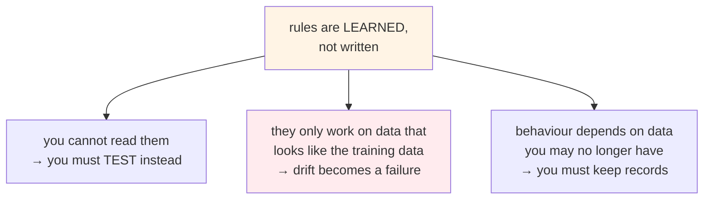
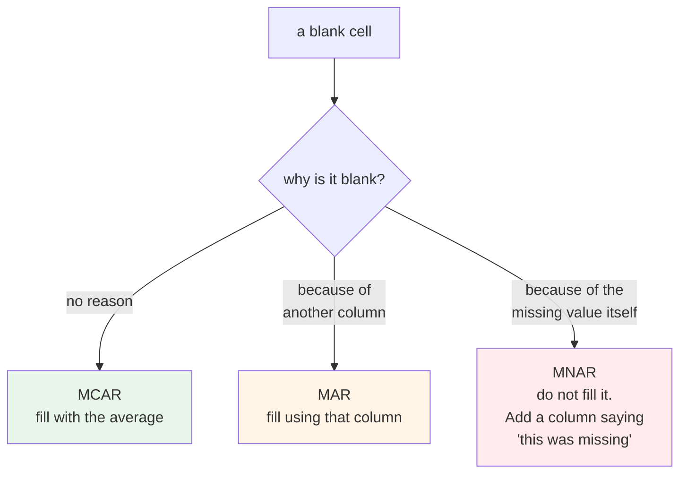
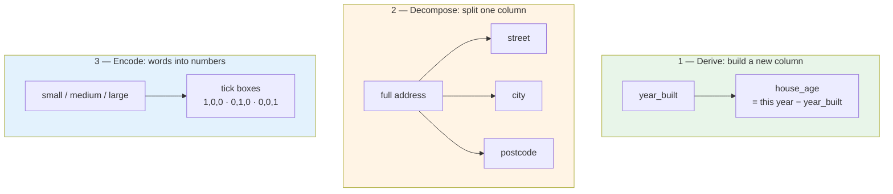
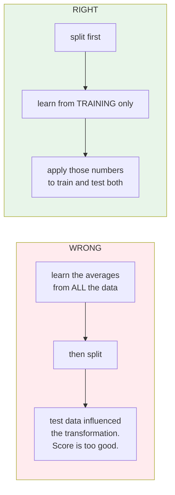
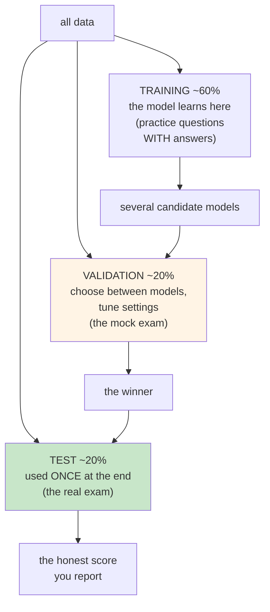
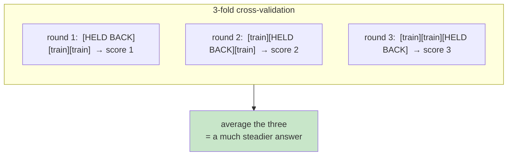
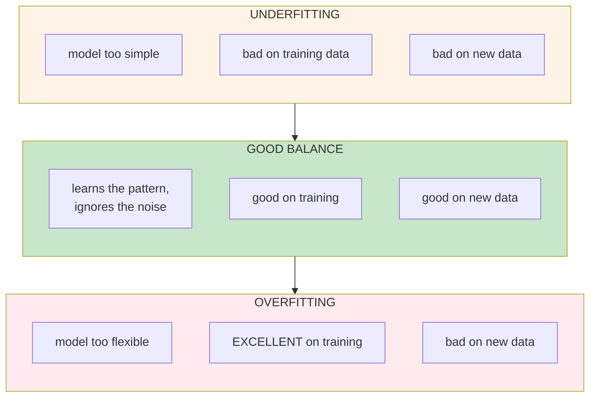
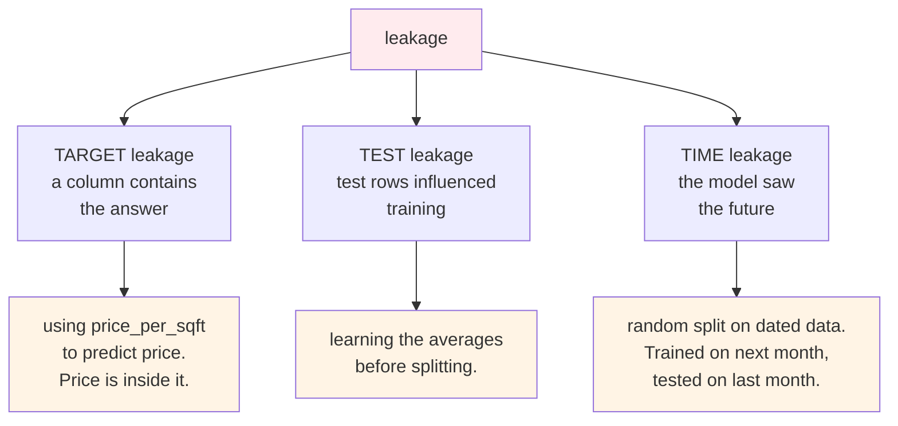
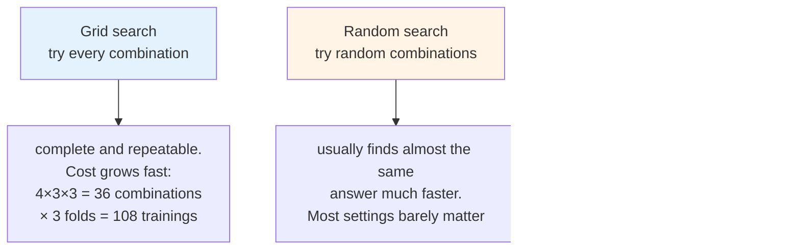

# Data, Features and Models

This page explains the ideas behind Module 3. The lab shows you how to run the pipeline. This page
explains what the pipeline is doing, and why each step exists.

Read it before the lab, or after it, or come back later when someone on your team says "we have
leakage" and you want to know what they mean.

---

## Why this is different from normal software

In normal software, you write the rules. If a bug appears, you read the code and find it.

In machine learning, **the rules are learned from data, not written by a person**. There is no
line of code saying "add 12% if the house has a garage". There is only a set of numbers that fit
the training data well.

Three things follow from this.



All three are operations problems. That is why they become your problem.

---

## Data Engineering

Data engineering is collecting the data and cleaning it so it can be used.

Think of cooking. Before you cook, you wash the vegetables, throw away the rotten ones, and cut
everything to the same size. Nobody calls this cooking, but the meal fails without it.

The rule of thumb is simple. **Good data with an average algorithm beats bad data with a great
algorithm.**

### Missing values

A missing value is a blank cell. Like a form where some people skipped a question.

Why they skipped it matters a lot. There are three cases.

| Name | What it means | Everyday example | Can you fill it in? |
|---|---|---|---|
| **MCAR** | missing for no reason | the pen ran out | Yes, safe |
| **MAR** | missing because of something else you know | older forms had no such box | Yes, using what you know |
| **MNAR** | missing because of the answer itself | people hide a low salary | **No. Filling it in creates a lie** |



The third case is the dangerous one. If people with low prices hide the price, and you fill those
blanks with the average, you have just told the model those houses are averagely priced. They are
not.

### Outliers

An outlier is a value far away from the rest. Like one very tall person in a class photo.

There are two reasons a value can be far away, and they need opposite treatment.

- **A mistake.** A price of ₹1. A house of 0 square feet. A year built of 12024. Remove it.
- **A real extreme.** A genuine mansion among small houses. This is true data.

If you remove real extremes, the data looks tidy and the model becomes blind. When a mansion
arrives later, the model will answer confidently and badly.

:::warning[Dropping rows is a real decision]
Every row you remove is something the model will never learn about.

In the lab, cleaning takes the data from 84 rows to 77. That is eight percent gone. Always ask
which eight percent. If they were all from one area or one price range, you have quietly removed
that group from the model's world.
:::

---

## Data Exploration

Data exploration, often called **EDA** (exploratory data analysis), is looking at the data before
building anything.

It is like walking around a house before you buy it. You are not fixing anything yet. You are
finding out what you are dealing with.

Data scientists mostly do four things here.

| What they plot | What it tells them |
|---|---|
| Distribution of the target | are prices spread evenly, or crowded at one end? |
| Correlation heat map | which columns move together? |
| Scatter plots | is the relationship a straight line, or something else? |
| Counts by category | is any group barely present in the data? |

In this project, square footage and price move together closely, and almost in a straight line.
Bigger house, higher price. Year built has the weakest relationship.

That is a useful finding. It tells you which columns carry the signal.

The count by location shows something else. The data is fairly even, except houses in the
mountains, where there are very few. The honest response is to collect more mountain houses, not
to pretend the model knows about them.

:::note[Why notebooks suit this work]
When you explore, you do not know the next step until you see the result of the current one. A
notebook lets you run one small block, look, change it, and run again.

This is why data scientists live in notebooks and care little about containers. It is the right
tool for the job they are doing.
:::

---

## Feature Engineering

A **feature** is a column the model learns from. Feature engineering is making better columns out
of the ones you already have.

This matters more than beginners expect. On table data, **good features usually beat a better
algorithm**. Switching from linear regression to gradient boosting might gain you a few percent. A
well-chosen feature can gain much more.

There are three things you can do.



**Deriving** is the obvious one. The raw data has `year_built`, but what the price depends on is
how old the house is. So `house_age` is a better column than the year.

**Decomposing** matters when one field holds several facts. An address is one column, but prices
often follow the postcode. Split it, and the model can see that pattern.

**Encoding** turns words into numbers, because a model cannot learn from the word `suburban`.

---

## Encoding and Scaling

### Encoding

Encoding is translation. The model only understands numbers, so words have to become numbers.

The simplest method is **one-hot encoding**, which works like tick boxes on a form. Three sizes
become three columns, and a small t-shirt is `1, 0, 0`.

There are several methods, and they behave very differently.

| Method | How it works | The cost | Use it when |
|---|---|---|---|
| **One-hot** | one column per category | many columns if many categories | few categories, no natural order |
| **Ordinal** | 0, 1, 2, 3 | tells the model there is an order | there really is an order (small, medium, large) |
| **Target** | replace with the average price for that category | **leaks easily** | many categories, and you are careful |
| **Hashing** | squeeze into fixed columns | two categories can collide | very many categories, low memory |
| **Embeddings** | learned number lists | needs a neural network and lots of data | very many categories, deep models |

:::warning[Too many categories]
One-hot encoding a postcode column with 20,000 different values gives you 20,000 columns. Training
slows down badly, memory fills up, and almost every column is zero.

This is your problem as much as the data scientist's, because it becomes a memory and training
time question. When someone proposes one-hot encoding a column with thousands of values, it is
worth a conversation.
:::

:::note[Embeddings are the same idea, grown up]
When people talk about vectors and vector databases for LLMs, that is encoding too. Words turned
into numbers so a machine can measure how close two things are.

One-hot is the crudest version, where every category is equally far from every other. Embeddings
learn the real distances.
:::

### Scaling

Scaling puts all columns into comparable units.

Imagine comparing people using height in centimetres and weight in kilograms. Height runs to 180,
weight runs to 80. Any method that measures distance will treat height as more important, only
because the numbers are bigger.

Scaling fixes that. **Standardisation** rescales a column to an average of 0. **Normalisation**
squeezes it between 0 and 1.

Whether you need it depends on the algorithm.

| Algorithm | Needs scaling? | Why |
|---|---|---|
| Linear and logistic regression | **Yes** | the numbers are in the column's units |
| SVM | **Yes** | it measures distance |
| Neural networks | **Yes** | helps training finish |
| Decision tree | **No** | it only compares values inside one column |
| Random forest, boosting | **No** | same reason |

Tree-based methods do not care about scale. That is one reason they are convenient on messy table
data.

Scaling matters to you for another reason. The drift detection in Module 10 works in the **scaled**
number space. That is the only space where a distance means the same thing in every column.

---

## The Preprocessor

The preprocessor is the saved transformation. It is one of the two files you carry into
production, and it is the one people forget.

Here is the important detail.



In code, `fit()` learns the numbers and `transform()` applies them. You **fit on training data and
transform everything**.

In production there is no fitting at all, only transform. That is exactly why the fitted object is
saved to disk as `preprocessor.pkl`, and why it must travel with the model everywhere it goes.

---

## Data Splitting

You cannot test a student using the same questions they studied. They have seen the answers.

Same for a model. So you hold some data back.

By convention, capital **X** is the input columns and small **y** is the answer. Once you know
that, most machine learning code becomes readable.

### Why two held-back sets, not one

Most introductions stop at train and test. That is not quite enough.

If you try five models and pick the one with the best test score, you have used the test set to
make a choice. Its score is now too optimistic, because you picked for it.



The test set is a one-time resource. Every time you look at it and change something, you use up a
little of its honesty.

### Cross-validation

On small data, holding back 20% has a problem. Your result depends on which 20% you happened to
pick. One unlucky pick and you draw the wrong conclusion.

The fix is like asking several friends to review your work instead of just one.

**K-fold cross-validation** splits the data into k parts, trains k times, each time holding back a
different part, then averages the scores.



That is what `cv=3` means in the lab. Every combination of settings is tested three times on three
different splits. It costs three times the compute and gives a result you can trust.

k=5 or k=10 is normal in real work. The course uses 3 because the data is tiny and the lab should
run fast.

---

## Overfitting and Underfitting

This is the most useful idea on this page. Almost every choice a data scientist makes is about
balancing these two.

Think of two students.

**The first did not study.** They fail the practice questions and they fail the exam. The problem
is they never learned the material. This is **underfitting**. In model terms, the model is too
simple to capture the real pattern.

**The second memorised the practice answers.** Full marks on practice, then they fail the exam
because the questions were worded differently. They learned the wrong thing. This is
**overfitting**. The model memorised the training rows instead of learning the pattern.



:::note[Overfitting is the one to worry about]
An underfitting model looks bad straight away and never gets deployed.

An overfitting model reports a wonderful training score, passes a quick review, gets deployed, and
then performs badly. It looks like success until it is in production.

The training score is not evidence. Only the held-back score is.
:::

### What moves you between them

| Change | Effect |
|---|---|
| More training data | less overfitting. The most reliable fix |
| Fewer columns | less overfitting, maybe more underfitting |
| Simpler algorithm | more underfitting, less overfitting |
| Deeper tree, more layers | less underfitting, more overfitting |
| More trees in a random forest | less overfitting, without adding much underfitting |

That last row is why random forests are such a safe default, and it is what `n_estimators` is
really buying you.

---

## Data Leakage

**Leakage** is when information that would not be available at prediction time gets into training.

It is like seeing the answer key before the exam. You score brilliantly, and you have learned
nothing.

This is the most common reason a model looks excellent in testing and fails in production.



The warning sign is always the same, and it is always tempting to believe: **a score that looks
too good**. A model that suddenly reports 99% has usually found a leak, not a breakthrough.

:::warning[There is a live example in this project]
Feature engineering creates `price_per_sqft`, which is price divided by square footage. Used as an
input to predict **price**, that is target leakage. The answer is inside the column.

In Module 10 you will see `df["price_per_sqft"] = 0` in `make_baseline.py`, a dummy value kept
only so the column count matches. That line exists because of this problem.

Worth knowing, because you will meet this in real projects and it is almost never labelled.
:::

---

## Model Training

Training is where the algorithm reads the training data and produces a model.

Worth being precise about two words, because people mix them up.

**Linear regression is an algorithm.** You apply it to data, it learns, and what comes out is the
**model**. So "random forest" is an algorithm, and the `.pkl` file on disk is a model.

There are also two kinds of numbers involved.

| | Who sets it | Example |
|---|---|---|
| **Parameters** | the model learns them during training | the weight given to square footage |
| **Hyperparameters** | you choose them before training | how many trees to build |

Think of baking. The oven temperature and timer are hyperparameters, which you set. How the cake
actually rises is the parameters, which you do not control directly.

---

## Model Evaluation

These numbers appear in MLflow and later in your gate thresholds, so they are worth knowing
properly.

For predicting a number, there are four common scores.

| Score | In words | Units | Behaviour |
|---|---|---|---|
| **MAE** | average size of the error | same as the price | treats all errors equally |
| **MSE** | average of the squared error | price squared | punishes big errors hard |
| **RMSE** | square root of MSE | same as the price | like MAE, but big errors count more |
| **R²** | how much better than just guessing the average | none, 0 to 1 | 1.0 is perfect, 0 is useless |

### A worked example

Two models predicting house prices, ten houses each. Errors in lakhs.

```
Model A errors:  5, 5, 5, 5, 5, 5, 5, 5, 5, 5
Model B errors:  0, 0, 0, 0, 0, 0, 0, 0, 0, 50

MAE    A = 5.0      B = 5.0       ← identical
RMSE   A = 5.0      B = 15.8      ← very different
```

Same MAE. Very different RMSE.

Think of two taxi drivers. The first is always five minutes late. The second is always exactly on
time, except once a month when they are fifty minutes late.

Which is better? It depends on you. For a school run, always five minutes late is manageable. For
catching a flight, the once-a-month disaster is unacceptable.

**MAE describes the first driver. RMSE catches the second.** Pick the score that matches what your
business considers a bad mistake.

:::tip[R² has a trap]
R² is popular because it has no units and 0.99 feels good.

But R² always goes up when you add columns, even useless random ones. Use **adjusted R²** when
comparing models with different numbers of columns, or you will conclude that more columns are
always better.
:::

---

## Hyperparameter Tuning

You would not pick one algorithm and hope. You list several, and for each you list the settings
worth trying.

There are three ways to search.



The course uses grid search because it is predictable and the data is small. On a real problem,
random search usually reaches a similar answer for far less compute.

Two settings are worth understanding, because both trade accuracy against compute.

**`n_estimators`** on a random forest is how many trees to build. More trees usually means a better
answer and more CPU time.

**`learning_rate`** on a boosting algorithm is how fast it learns from its mistakes. It is like
eating. Eat too fast and you finish quickly but do not digest properly. Go slower and you learn
better, but it takes longer.

:::note[This is a capacity question, and it is yours]
36 combinations at cv=3 is 108 model trainings. On this tiny dataset that takes seconds. On real
data it can take hours on a large machine.

When a data scientist asks for "a machine to run experiments on", this arithmetic is behind the
request.
:::

---

## Experiment Tracking

Every training run gets recorded. Which algorithm, which settings, which score, and the model
file itself.

Imagine a cook who never writes anything down. They make something delicious once, and can never
make it again, because nobody recorded the quantities.

**MLflow** is the notebook where the quantities get written down.

This matters for a reason that has nothing to do with data science. Six months from now somebody
will ask why the model predicts what it predicts. Without records, the honest answer is "we do not
know".

---

## Reproducibility

Same data, same code, same settings should give the same model. That does not happen by itself.

| What can vary | How you pin it down |
|---|---|
| The train/test split | `random_state` seed |
| Randomness inside the algorithm | `random_state` on the model |
| Library versions | pinned `requirements.txt`, plus a container image |
| The data itself | **data versioning** — DVC, lakeFS, or storage that never changes |
| Which run made which model | **experiment tracking** — MLflow |

The last two are the ones teams skip and later regret. Versioning your code is not enough, because
the same code over different data gives a different model.

:::warning[An honest gap in this course]
This project versions code and tracks experiments. It does **not** version data. `data/raw/` is a
file in Git, which only works because the file is tiny and never changes.

On a real project you would need DVC or something like it. Without it, "which data trained this
model" has no answer, and the retraining loop in Module 10 cannot be traced.
:::

---

## Quick Reference

**Notation**

| Symbol | Meaning |
|---|---|
| `X` | input columns (capital, because it is a table) |
| `y` | the answer (small, because it is a single column) |
| `X_train`, `y_train` | what the model learns from |
| `X_test`, `y_test` | held back. `y_test` is never shown to the model |

**Methods**

| Call | What it does | Learned from |
|---|---|---|
| `fit()` | learn the numbers, or learn the model | training data only |
| `transform()` | apply what was learned | everything |
| `fit_transform()` | both together | **training only**. Using it on test data is leakage |
| `predict()` | produce answers | — |

**Warning signs**

| What you see | What to suspect |
|---|---|
| training score much better than test score | overfitting |
| both scores poor | underfitting |
| a score that looks too good | leakage |
| score changes a lot between runs | too little data, or no seed set |
| score dropped after deployment | drift, or the preprocessor does not match |

---

## In the lab

You will run the three scripts that turn `house_data.csv` into a trained model, look at the four
notebooks behind them, and watch every run appear in MLflow.

Two things to watch for, because they connect to this page. The row count dropping from 84 to 77
during cleaning, and the fact that you finish with **two** files, not one.

---

## Going deeper

- *An Introduction to Statistical Learning* — James, Witten, Hastie, Tibshirani. Free PDF. Chapters 2 and 5 cover overfitting and cross-validation better than anything else at this level
- *Feature Engineering for Machine Learning* — Zheng and Casari
- [scikit-learn: common pitfalls](https://scikit-learn.org/stable/common_pitfalls.html) — leakage and how to avoid it, from the people who wrote the library
- [scikit-learn: cross-validation](https://scikit-learn.org/stable/modules/cross_validation.html)
- Bergstra and Bengio, *Random Search for Hyper-Parameter Optimization* (2012) — the paper behind random search
- [Hidden Technical Debt in Machine Learning Systems](https://papers.nips.cc/paper/2015/hash/86df7dcfd896fcaf2674f757a2463eba-Abstract.html) — Sculley et al., Google. The paper that named the problem MLOps exists to solve. Read this one
