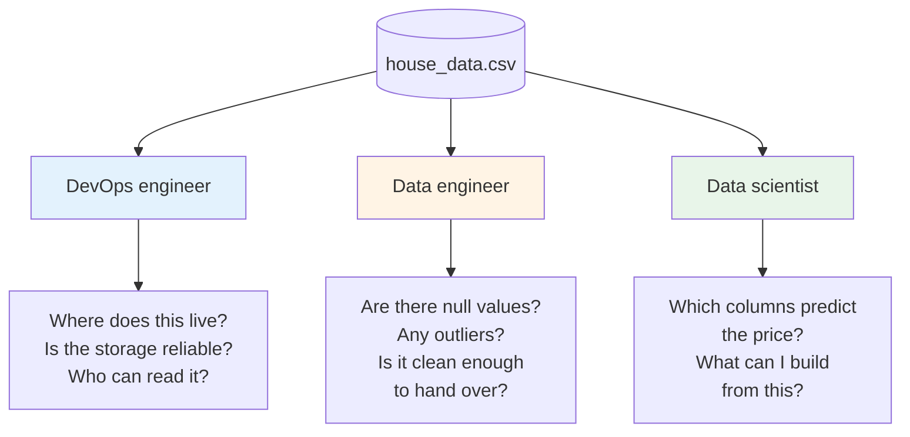
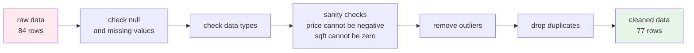
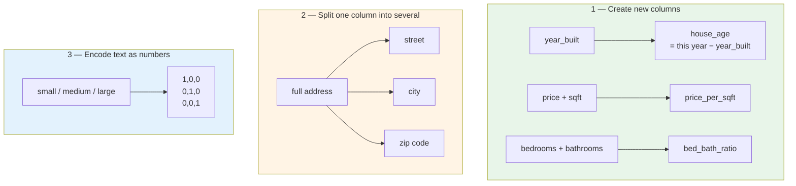
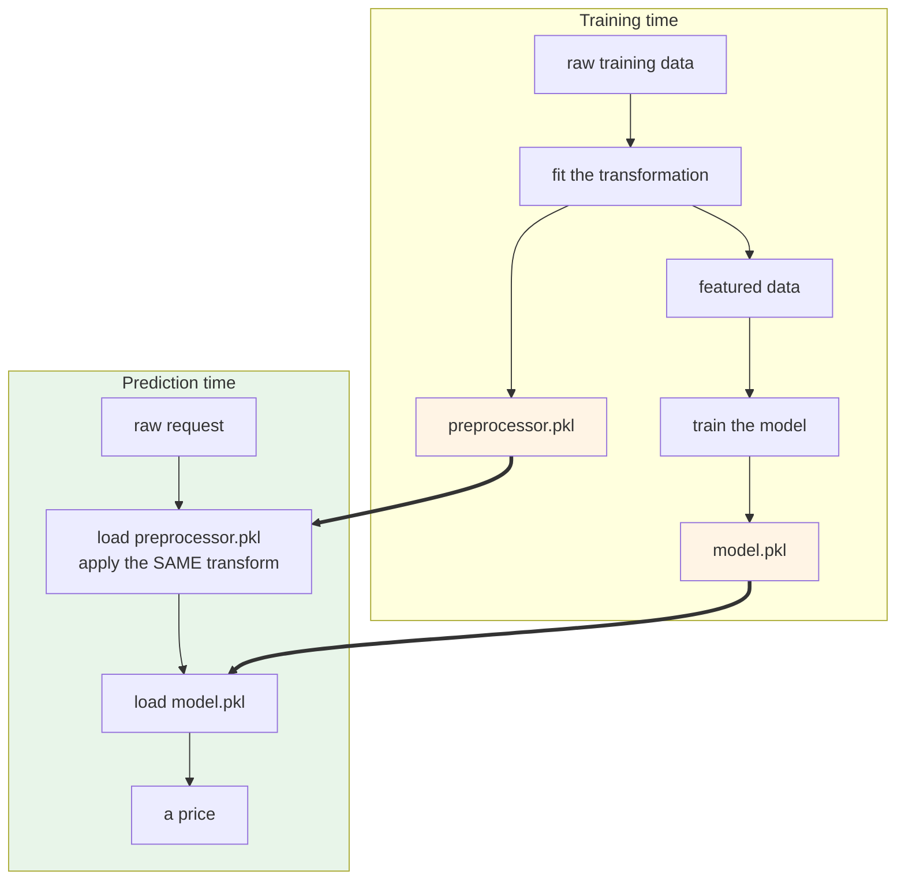
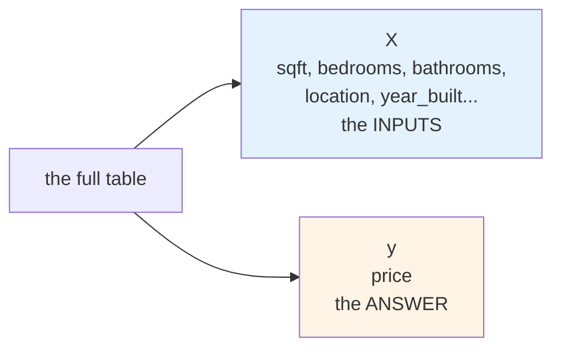
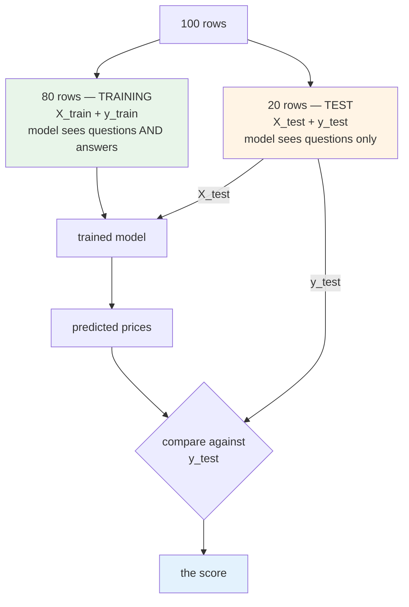
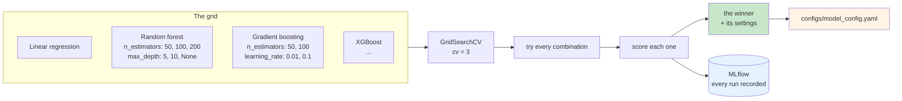

# From Raw Data to a Trained Model

You are not going to be asked to build models for a living. So why does an MLOps engineer need
to sit through data cleaning and feature engineering?

Same reason a DevOps engineer learns how the application is built. You cannot automate a
pipeline you do not understand. You cannot size the machines for a training job if you have no
idea what the job does. And when you are in a meeting with a data scientist, you need to follow
what they are saying.

This module puts you in their chair for a while. You will not write much code. You will read
what they wrote, run it, and understand why each step exists.

## What you'll learn

- Clean a raw dataset and explain what was dropped and why
- Build engineered features and save the transformation as a reusable preprocessor
- Split data into training and test sets, and read `X_train`, `y_train`, `X_test`, `y_test`
- Define algorithm and hyperparameter grids, and compare the runs
- Track every experiment in MLflow and defend which model won

## The same data, three different pairs of eyes

One CSV file sits on a shared drive. Three people open it and see three completely different
things.

None of them is wrong. They are just solving different problems with the same file. In a real
team you sit next to all three, so it helps to know which question each one is asking.

## Step one, the data engineer cleans it

The quality of the data decides the accuracy of the model. Nothing you do later recovers from
bad data going in.

A data engineer starts by asking where the data even comes from. Transaction logs. Application
logs. A third-party feed. For learning, a public dataset from somewhere like Kaggle. Then they
pull it together into one table and start fixing it.

In this project the cleaning step removes seven rows and you end up with 77. Those seven were
outliers, which is nothing but values so far from the rest that they pull the model's answers
around with them.

:::warning[Dropping rows is a decision, not a detail]
Every row you remove is a choice about what the model will never learn from. If the rows you
drop share something in common, for example they are all from one neighbourhood, you have just
taught the model to ignore that neighbourhood.

Always ask which rows were dropped and why. "The script removed them" is not an answer.
:::

A missing value has the same weight of decision behind it. Do you fill it with the average? With
the most common value? Do you drop the row? Each choice changes the model. This is where domain
knowledge matters more than code.

## Step two, the data scientist explores it

Now the file moves to the data scientist, and they do something called **exploratory data
analysis**, or EDA. The goal is not to build anything. The goal is to understand the data well
enough to know what is worth building.

They plot things.

- **A distribution of prices**, to see whether the data is balanced or crowded at one end
- **A correlation heat map**, to see which columns move together
- **Scatter plots**, to see whether a relationship is a straight line or something messier
- **Bar charts by category**, to see whether some groups barely appear in the data

In this dataset, square footage and price turn out to be closely related, and close to linear.
Bigger house, higher price, in a fairly straight line. Year built turns out to be the weakest
relationship of the lot.

That is a useful finding. It tells you which columns carry the signal.

The bar chart by location shows something else. The data is reasonably balanced except for
houses in the mountains, where there are very few. So the honest next step is to go and collect
more mountain houses, rather than pretend the model knows anything about them.

:::note[Why data scientists love notebooks]
Talk to a data scientist and you may notice they do not care much about containers or Git. Give
them a notebook, a virtual environment and the data, and they are happy.

That is not carelessness. Exploration means you do not know the next step until you see the
result of this one. A notebook suits that. A script does not.
:::

## Step three, feature engineering

A **feature** is nothing but a column the model learns from. **Feature engineering** is making
better columns out of the ones you already have.

There are three different things hiding under that one name.

**Creating new columns** is the obvious one. The raw data has `year_built`, but what the price
actually depends on is how old the house is. So `house_age` is a better column to learn from
than the year itself.

**Splitting a column** matters when one field holds several facts. A full address is one column,
but prices often follow zip codes. Split it, and the model can see the pattern.

**Encoding** turns words into numbers, because a model cannot learn from the word `suburban`.
The t-shirt example is the easiest way to hold it. Small, medium and large become three columns,
and a small t-shirt is `1, 0, 0`. This is called **one-hot encoding**.

That same idea grows up into something you may have heard of elsewhere. When people talk about
vectors and vector databases for large language models, a vector is a form of encoding too. Text
turned into numbers, so a machine can measure how close two things are.

### The preprocessor, and why it is the artifact people forget

Here is the part that bites teams later.

You engineered these features during training. At prediction time, a request arrives with raw
values, `sqft`, `bedrooms`, `location`. Those have to go through **exactly the same
transformation** before the model sees them.

So the transformation is not just applied, it is **saved**, as `preprocessor.pkl`.

You end up with **two** files, not one. People remember the model and forget the preprocessor.
When the two drift apart, nothing crashes. The predictions just quietly go wrong, which is much
worse.

## Step four, splitting the data

Now the model needs to learn, and you need a way to check whether it learned anything.

You cannot test a model on the data it learned from. It has seen those answers already. So the
data gets split, twice.

**First split, X and y.**

Capital `X` is what the model reads. Small `y` is what it has to predict. Once you know that,
most machine learning code becomes much easier to read.

**Second split, train and test.**

Think of it like studying for an exam.

While studying, you get the problems **and** the worked solutions. That is the training set,
`X_train` and `y_train`.

In the exam, you get the questions only. That is `X_test`. You produce answers, and the examiner
compares them against the real solutions, `y_test`, which you never saw.

:::warning[y_test is never shown to the model]
This is the whole point. The moment test answers leak into training, your score becomes
meaningless and you will not find out until production.
:::

The `random_state` value you see in the code is there so the split happens the same way every
time. Same split, same result, reproducible experiment.

## Step five, running the experiments

Now, which algorithm?

You would not pick one and hope. You list several candidates and let the code try them all.

:::note[Algorithm or model?]
Worth being precise, because people use the words loosely. **Linear regression is an
algorithm.** You apply it to data, it learns, and the learned thing that comes out is the
**model**.

So "random forest" is an algorithm. The `.pkl` file on your disk is a model.
:::

For each algorithm you also list the settings worth trying. Those are **hyperparameters**, which
are nothing but the values you choose rather than the ones the model learns.

Two of those settings are worth understanding, because they both trade accuracy against compute.

**`n_estimators` on a random forest** is how many trees it builds. More trees usually means a
better decision, and also more CPU and more time. So you look for a value that is good enough
rather than the highest one.

**`learning_rate` on a boosting algorithm** is how fast it learns from its mistakes. It is a bit
like eating. Eat too fast and you finish quickly, but you do not digest it properly. Go slower
and you learn better, but it takes longer and costs more compute.

**`cv = 3`** means cross validation with three folds. The data gets split three different ways,
each combination is tried on each split, and the results are averaged. One lucky split cannot
crown a winner on its own.

The output of all this is `configs/model_config.yaml`, holding the winning algorithm and its
settings. That file is the handover to the training script, and to you.

## Why MLflow was running the whole time

Every one of those runs gets recorded. The parameters used, the score achieved, and the model
itself.

That matters for a reason that has nothing to do with data science. Six months from now,
somebody will ask why the model predicts what it predicts. Without a record, the honest answer
is "we do not know". With MLflow, you can point at the exact run.

You will come back to this in Module 10, where a drifting model triggers a retrain and you need
to compare the new model against the old one to decide whether it is safe to ship.

## What you should have at the end

Running the lab leaves you with:

- `data/processed/cleaned_house_data.csv`, the cleaned data
- `data/processed/featured_house_data.csv`, with the engineered columns
- `models/trained/preprocessor.pkl`, the saved transformation
- `models/trained/house_price_model.pkl`, the trained model
- `configs/model_config.yaml`, the winning configuration
- runs visible in MLflow at `localhost:5555`

Those last two files, the model and the preprocessor, are exactly what a data scientist would
hand you in real life.

In Module 4 you stop being the data scientist. You take those two files, wrap them in an API,
and package the whole thing into a container image that runs anywhere.
