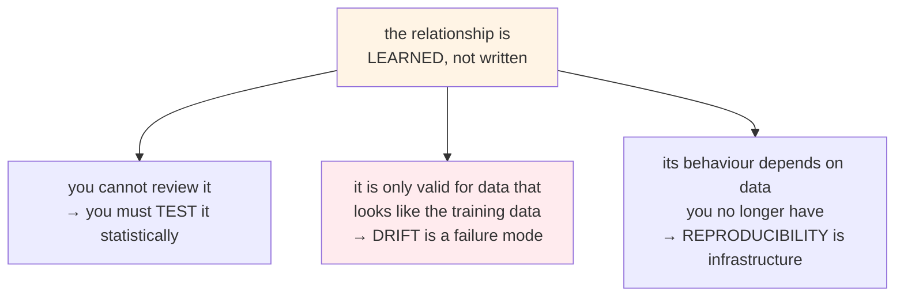
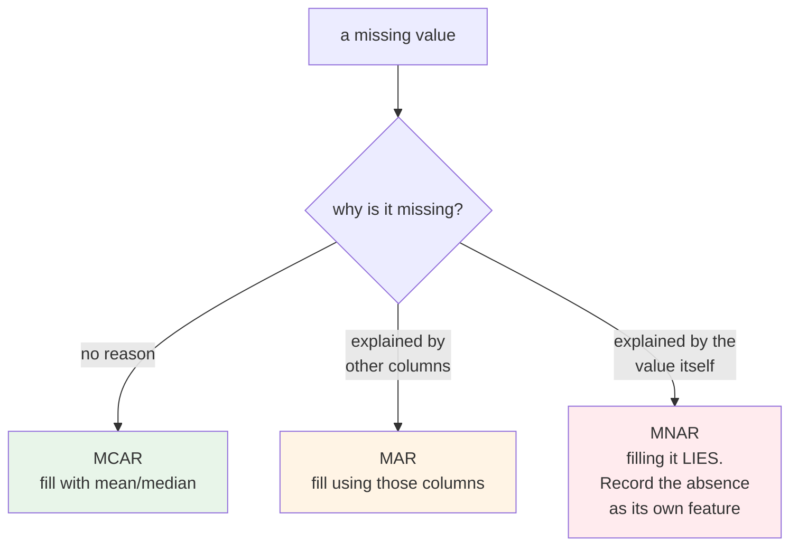
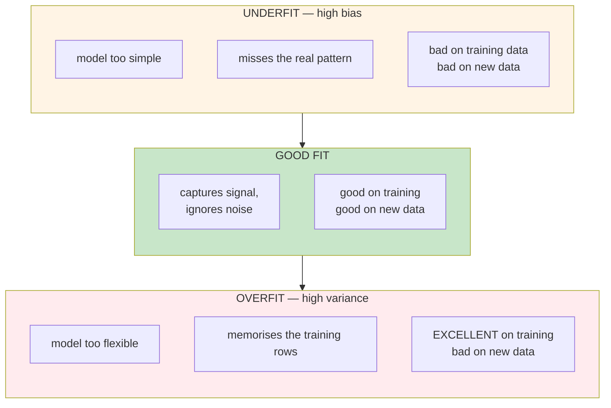
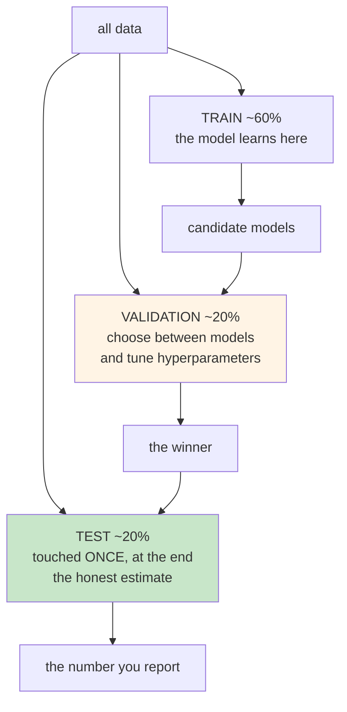
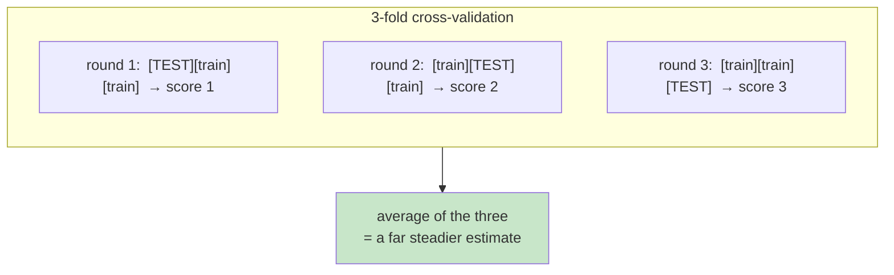
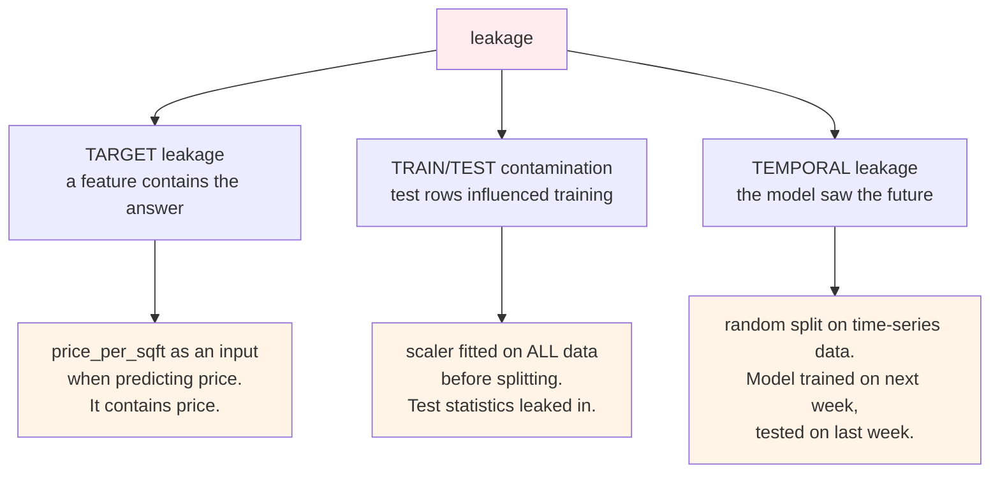
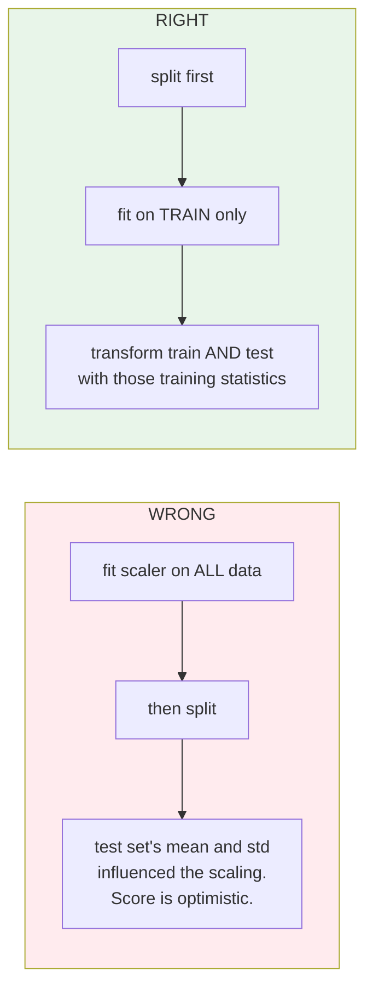
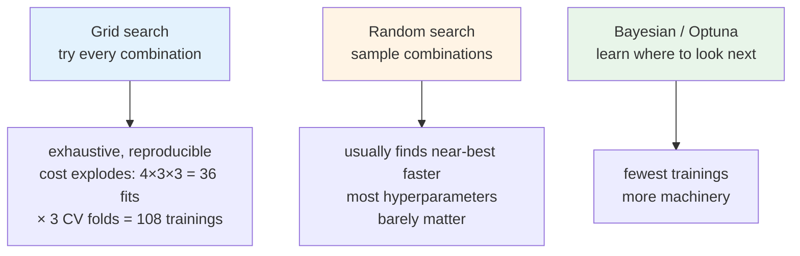

# Data, Features and Models

This page is the reference chapter for the ideas behind Module 3. It goes further than the lab
needs, on purpose. Read it before the lab for grounding, or after it when something did not quite
make sense, or come back to it in six months when a data scientist says "we have leakage" and you
want to know what that means.

The lab teaches you to run the pipeline. This teaches you what the pipeline is doing.

---

## 1. Why this is hard

A model is an algorithm that has learned a relationship from data. Everything difficult about
machine learning follows from one property of that sentence: **the relationship is learned, not
written**.

Nobody can read the model and check the logic. There is no line of code saying "add 12% if the
house has a garage". There is a set of numbers that happens to reproduce the training data well.

That has three consequences you will live with for the rest of this course.



Each of those is an operational problem, not a modelling one. Which is why they are your problem.

---

## 2. Data quality dominates everything

There is an old rule that holds up well: the quality of the data sets the ceiling on the quality
of the model. A better algorithm on bad data loses to a mediocre algorithm on good data, almost
every time.

### 2.1 Missing values are not all the same

Statisticians separate missing data into three kinds, and the distinction decides what you are
allowed to do about it.

| Kind | Meaning | Example | Safe to fill in? |
|---|---|---|---|
| **MCAR** — missing completely at random | the gap has nothing to do with anything | a sensor dropped a reading | Yes, low risk |
| **MAR** — missing at random | the gap depends on *other columns you have* | older listings omit `condition` | Yes, if you use those columns |
| **MNAR** — missing not at random | the gap depends on *the missing value itself* | owners hide the price when it is very low | **No. Filling it in creates bias** |



The MNAR case is the dangerous one, because the usual fix makes it worse. If low prices are
systematically missing and you fill them with the average, you have just taught the model that
those houses are averagely priced. The honest move is often to add a `price_was_missing` column
and let the model use the absence as information.

:::warning[Dropping rows is a modelling decision]
Every row you drop is a decision about what the model will never learn. If the dropped rows share
something — one neighbourhood, one price band, one time period — you have quietly removed that
group from the model's world.

In the lab, cleaning takes 84 rows down to 77. Eight percent of the data. Always ask which eight
percent.
:::

### 2.2 Outliers, and the two reasons they appear

An outlier is a value far from the rest. There are two completely different causes and they need
opposite treatment.

- **An error.** A price of ₹1, a square footage of 0, a year built of 12024. Remove it.
- **A real extreme.** A genuine mansion in a dataset of ordinary houses. It is true data.

Removing real extremes makes the model neater and blind. A model trained only on ordinary houses
will predict confidently and badly when a mansion arrives — and it will not tell you, which is
exactly the drift problem from Module 10 arriving early.

---

## 3. The central trade-off: bias and variance

This is the single most useful idea in this chapter. Almost every choice a data scientist makes is
a move along this axis.

**Bias** is error from the model being too simple to capture the real pattern.
**Variance** is error from the model being so flexible that it learns the noise as well as the
signal.



### The exam analogy, taken one step further

A student who has not studied fails both the practice papers and the real exam. That is
**underfitting**.

A student who memorises the answers to the practice papers scores full marks on them, then fails
the real exam because the questions are different. That is **overfitting**, and it is the more
dangerous of the two, because on the surface it looks like success.

:::note[Why overfitting is the one to fear operationally]
An underfit model looks bad immediately and never ships. An overfit model reports a wonderful
training score, passes a casual review, ships, and performs badly in production.

The training score is not evidence. Only the held-out score is.
:::

### What moves you along the axis

| Move | Effect |
|---|---|
| More training data | reduces variance. The most reliable fix there is |
| Fewer features | reduces variance, may add bias |
| Simpler algorithm | more bias, less variance |
| Deeper tree / more layers | less bias, more variance |
| Regularisation | deliberately adds a little bias to cut variance |
| More trees in a random forest | reduces variance without much added bias |

That last row is why random forests are such a dependable default, and it is what
`n_estimators` is actually buying you.

---

## 4. Splitting data, and why one split is not enough

### 4.1 The basic split

You cannot judge a model on data it learned from. So you hold some back.

By convention, capital **X** is the input matrix and small **y** is the target vector. Once you
know that, most ML code becomes readable.

### 4.2 Why you need a third set

Here is the part most introductions skip.

If you use the test set to *choose* between models — try five algorithms, pick the one with the
best test score — then you have used the test set to make a decision. Its score is now
optimistic, because you selected for it.



The test set is a one-shot resource. Every time you look at it and change something, you spend a
little of its honesty.

### 4.3 Cross-validation, and what `cv=3` means

Holding out 20% has a problem on small data: your estimate depends on which 20% you happened to
hold out. One unlucky split and you draw the wrong conclusion.

**K-fold cross-validation** removes that luck. Split the data into k parts, train k times, each
time holding out a different part, then average the scores.



That is what `GridSearchCV(..., cv=3)` is doing. Every hyperparameter combination is evaluated
three times on three different splits. It costs three times the compute and buys you a result you
can trust.

:::tip[Choosing k]
k=5 or k=10 is typical. Higher k means a better estimate and more compute. The course uses 3
because the dataset is tiny and the runtime should stay short.
:::

---

## 5. Data leakage — the failure that looks like success

**Leakage** is when information that would not be available at prediction time leaks into
training. It is the most common cause of a model that scores brilliantly and fails in production.



The symptom is always the same and always seductive: **an unusually good score**. A model that
suddenly reports 99% accuracy has usually found a leak, not a breakthrough.

:::warning[There is a live example in this project]
The feature engineering step creates `price_per_sqft`, computed as price divided by square
footage. As a training input for predicting **price**, that is textbook target leakage — the
answer is inside the feature.

Look at `make_baseline.py` in Module 10 and you will see `df["price_per_sqft"] = 0`, a dummy value
kept only so the column count matches. That line is a scar from exactly this issue.

Worth knowing, because you will meet this pattern in real projects and it is rarely labelled.
:::

### Why the preprocessor is fitted on training data only

This is the mechanical defence against contamination, and it explains a detail that otherwise
looks arbitrary.



`fit()` learns the statistics. `transform()` applies them. You **fit on training data, transform
everything**. At prediction time in production there is no fitting at all, only transform — which
is precisely why the fitted object is saved to disk as `preprocessor.pkl`.

---

## 6. Feature engineering, properly

A feature is a column the model learns from. Feature engineering is making better columns.

It is worth taking seriously because on tabular data, **good features usually beat a better
algorithm**. Moving from linear regression to gradient boosting might buy you a few percent. A
well-chosen feature can buy far more.

### 6.1 Three operations

| Operation | What it does | Example |
|---|---|---|
| **Derive** | combine existing columns | `house_age = this_year − year_built` |
| **Decompose** | split one column into several | address → street, city, postcode |
| **Encode** | turn categories into numbers | `location` → indicator columns |

### 6.2 Encoding is a decision with consequences

Most introductions show one-hot encoding and stop. There are several schemes and they behave very
differently.

| Scheme | How it works | Cost | Use when |
|---|---|---|---|
| **One-hot** | one column per category | explodes with high cardinality | few categories, no natural order |
| **Ordinal** | map to 0,1,2,3 | implies an order that may not exist | genuinely ordered (small/medium/large) |
| **Target / mean** | replace with the mean target for that category | **leaks badly** unless done inside CV folds | high cardinality, and you are careful |
| **Hashing** | hash into a fixed number of columns | collisions, unexplainable | very high cardinality, memory-bound |
| **Embeddings** | learned dense vectors | needs a neural network, needs data | very high cardinality, deep models |

:::warning[The cardinality trap]
One-hot encoding a postcode column with 20,000 distinct values produces 20,000 columns. Your
feature matrix explodes, training slows to a crawl, and most columns are almost entirely zero.

This is an infrastructure problem as much as a modelling one — memory, training time, model size.
When a data scientist proposes one-hot encoding a high-cardinality column, that is a conversation
worth having.
:::

:::note[Embeddings are the same idea, grown up]
When people talk about vectors and vector databases for LLMs, that is encoding too. Categories
turned into numbers so a machine can measure how close two things are.

One-hot is the crudest version: every category equally distant from every other. Embeddings learn
the distances. Same problem, different sophistication.
:::

### 6.3 Scaling, and who actually needs it

Standardisation rescales a column to mean 0 and standard deviation 1. Normalisation squeezes it
into a range, usually 0 to 1.

Whether you need it depends entirely on the algorithm:

| Algorithm family | Needs scaling? | Why |
|---|---|---|
| Linear and logistic regression | **Yes** | coefficients are in the units of the feature |
| SVM | **Yes** | it measures distances |
| Neural networks | **Yes** | helps training converge |
| Decision tree | **No** | it only compares thresholds within one column |
| Random forest, boosting | **No** | same reason |

Tree-based models are indifferent to scale, which is part of why they are so convenient on messy
tabular data.

Scaling matters to you for a second reason: the z-score drift detection in Module 10 operates in
the **scaled** feature space. That is not a coincidence — it is the only space where a distance
means the same thing across columns.

---

## 7. Evaluation: what the scores actually mean

You will see these numbers in MLflow and in gate thresholds. Worth knowing precisely.

For regression — predicting a number — the four common ones:

| Metric | Formula, in words | Units | Behaviour |
|---|---|---|---|
| **MAE** | average of \|error\| | same as target | treats all errors equally |
| **MSE** | average of error² | target squared | punishes large errors hard |
| **RMSE** | square root of MSE | same as target | like MAE but weighted toward big misses |
| **R²** | fraction of variance explained | none, 0 to 1 | 1.0 is perfect, 0 is no better than the mean |

### Which to use, with a worked example

Two models predicting house prices, ten houses each.

```
Model A errors: 5, 5, 5, 5, 5, 5, 5, 5, 5, 5      (lakhs)
Model B errors: 0, 0, 0, 0, 0, 0, 0, 0, 0, 50

MAE   A = 5.0      B = 5.0      ← identical
RMSE  A = 5.0      B = 15.8     ← very different
```

Same MAE. Wildly different RMSE.

Which model is better depends entirely on the business question. If being 50 lakhs wrong on one
house is catastrophic, model A is better and RMSE tells you so. If consistent small errors annoy
users more, model B is better and MAE tells you so.

:::tip[R² and its trap]
R² is popular because it is unitless and "0.99" feels good. But R² always increases when you add
features, even useless random ones.

Use **adjusted R²** when comparing models with different feature counts, or you will conclude that
more features are always better.
:::

For classification you would instead meet precision, recall, F1 and AUC. Different module, same
principle: **the metric encodes what you consider a bad mistake.**

---

## 8. Hyperparameters and the search over them

**Parameters** are learned by the model during training. You never set them.
**Hyperparameters** are chosen by you before training. The model never learns them.

Three ways to search the space:



The course uses grid search because it is predictable and the dataset is small. On a real problem,
random search usually gets you to a similar place for a fraction of the compute — a result that
surprised people when it was first published, and holds up.

:::note[This is a capacity question, and it is yours]
A grid of 36 combinations at cv=3 is 108 model trainings. On this dataset that is seconds. On a
real dataset it can be hours on a large machine.

When a data scientist asks for "a machine to run experiments on", this is the arithmetic behind
the request.
:::

---

## 9. Reproducibility as infrastructure

Same data, same code, same config should produce the same model. That is not automatic.

| Source of variation | How it is pinned |
|---|---|
| Train/test split | `random_state` seed |
| Algorithm randomness | `random_state` on the estimator |
| Library versions | pinned `requirements.txt`, and a container image |
| The data itself | **data versioning** — DVC, lakeFS, or immutable object storage |
| Which run produced what | **experiment tracking** — MLflow |

The last two are the ones teams skip and later regret. Code versioning alone is not enough,
because the same code over different data produces a different model.

:::warning[Honest gap in this course]
This project versions code and tracks experiments. It does **not** version data. `data/raw/` is a
file in Git, which works only because the file is tiny and never changes.

On a real project you would need DVC or equivalent. Without it, "which data trained this model"
has no answer, and the retraining loop in Module 10 becomes untraceable.
:::

---

## 10. Quick reference

**Notation**

| Symbol | Meaning |
|---|---|
| `X` | input features (capital — it is a matrix) |
| `y` | target (lowercase — it is a vector) |
| `X_train`, `y_train` | what the model learns from |
| `X_test`, `y_test` | held back; `y_test` is never shown to the model |

**Method names**

| Call | What it does | Fitted on |
|---|---|---|
| `fit()` | learn the statistics or the model | training data only |
| `transform()` | apply learned statistics | everything |
| `fit_transform()` | both at once | **training only** — using this on test data is leakage |
| `predict()` | produce answers | — |

**Warning signs**

| You see | Suspect |
|---|---|
| training score ≫ test score | overfitting |
| both scores poor | underfitting |
| suspiciously perfect score | leakage |
| score swings between runs | too little data, or no seed set |
| score fell after deployment | drift, or train/serve skew |

---

## 11. In the lab

You will run the three scripts that turn `house_data.csv` into a trained model, explore the four
notebooks behind them, and see every run appear in MLflow.

Watch for two things specifically, because they connect to this chapter: the row count dropping
from 84 to 77 during cleaning, and the fact that you finish with **two** artifacts rather than
one.

---

## 12. Going deeper

- *An Introduction to Statistical Learning* — James, Witten, Hastie, Tibshirani. Free PDF. Chapters 2 and 5 cover bias-variance and cross-validation better than anything else at this level
- *Feature Engineering for Machine Learning* — Zheng and Casari
- [scikit-learn: common pitfalls](https://scikit-learn.org/stable/common_pitfalls.html) — leakage and how to avoid it, from the source
- [scikit-learn: cross-validation](https://scikit-learn.org/stable/modules/cross_validation.html)
- Bergstra and Bengio, *Random Search for Hyper-Parameter Optimization* (2012) — the paper behind §8
- [Hidden Technical Debt in Machine Learning Systems](https://papers.nips.cc/paper/2015/hash/86df7dcfd896fcaf2674f757a2463eba-Abstract.html) — Sculley et al., Google. The paper that named the problem MLOps exists to solve. Read this one
