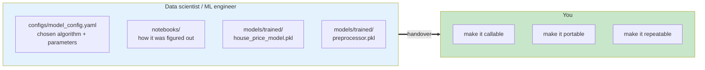
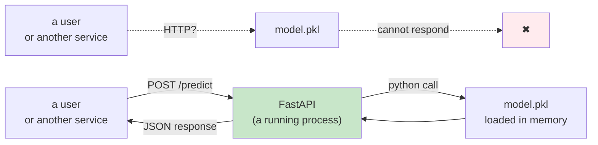
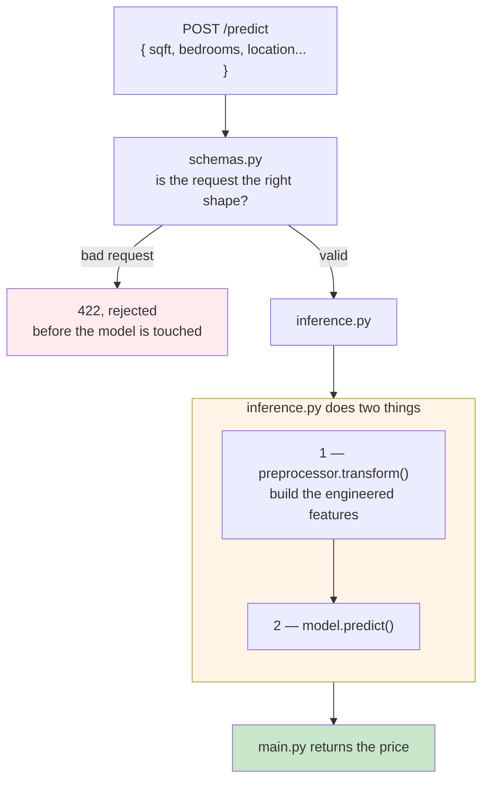
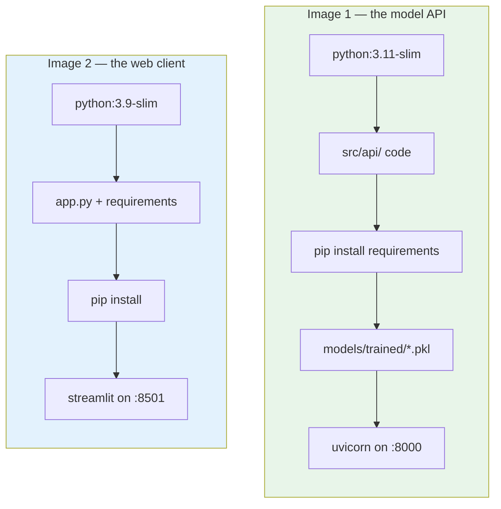
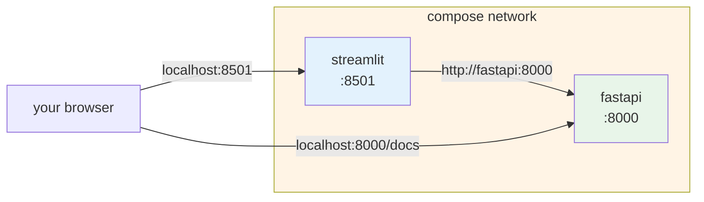
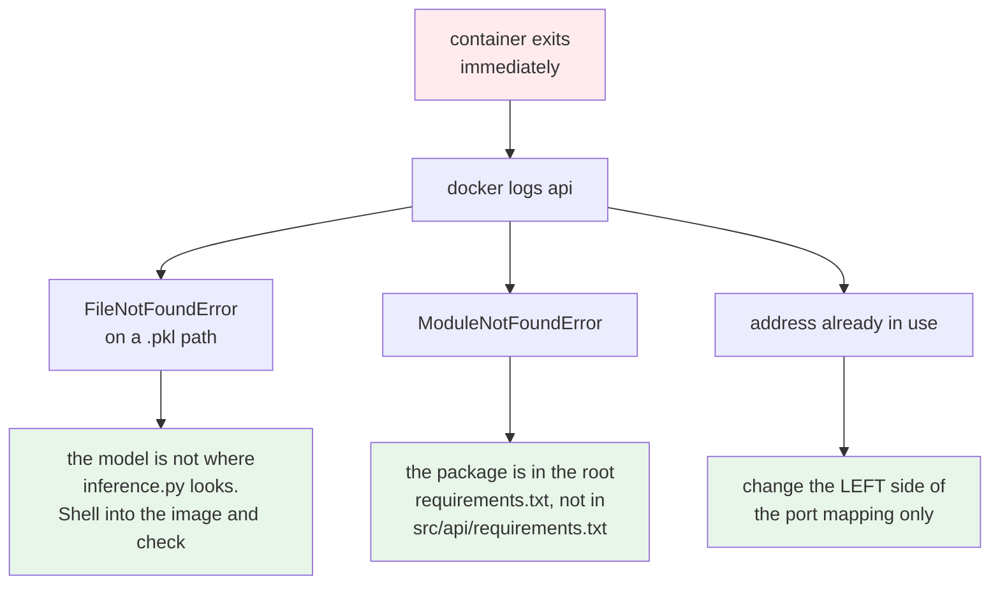

# Packaging the Model and Serving it with FastAPI

This is the module where you stop borrowing somebody else's chair and sit in your own.

Up to now you have been following the data scientist's work. From here the container knowledge
you already have starts paying off. You would package a model into an image, put an API in front
of it, and run the whole thing as a stack.

:::note[What is assumed here]
Working knowledge of Docker. Writing a Dockerfile, building an image, and reading a Compose
file. If any of that is shaky, go and cover Docker first. This module shows you how to apply
that knowledge to a model, not what a container is.
:::

## What you'll learn

- Explain what a data scientist hands over, and what is missing from that handover
- Wrap a model in a FastAPI service with request validation
- Write a Dockerfile that packages code and model together, ordered for layer caching
- Run the API and the web interface together with Docker Compose
- Debug a container that builds cleanly but exits on start

## What actually crosses the line

The handover is not a conversation. It is a set of files.



Two of those four are the important ones, and you met them in Module 3. The **model** and the
**preprocessor**. They travel together, always.

:::note[Who does this job?]
It depends on the organisation. In a smaller team the ML engineer writes the FastAPI app and the
Dockerfile themselves, the same way a software engineer would. In a larger one there is a
dedicated MLOps team, and you are helping the ML engineers containerise their work.

Either way, the work below is the same.
:::

## Why a `.pkl` file cannot be a service

Here is the core problem of this module, in one picture.



A pickle file is a saved Python object sitting on disk. It is not a program. Nothing can talk to
it over the network, and it cannot listen for anything.

Systems talk to each other over HTTP. So somebody has to write a small program that loads the
model into memory, listens on a port, accepts a request, calls the model, and sends the answer
back.

That program is the FastAPI application, and it is the thing you would actually deploy.

:::note[Inference and prediction are the same thing]
You will hear both words. When a client calls `/predict`, the code behind it runs the model over
the input and produces an answer. That act is called **inference**.

So running the FastAPI app is running inference. Nothing more mysterious than that.
:::

## What the API is made of

Three small files under `src/api/`, each with one job.



**`schemas.py`** defines the shape of a request. FastAPI checks incoming data against it, so a
request with a missing field, or text where a number should be, gets rejected before it ever
reaches your model. You get that for free just by declaring the shape.

**`inference.py`** does the real work. It loads both files with `joblib`, applies the
preprocessor, then calls `model.predict()`.

**`main.py`** wires it into a web service with three endpoints:

| Endpoint | What it is for |
|---|---|
| `/health` | a cheap liveness check. Used later by Kubernetes and by synthetic traffic |
| `/predict` | one prediction |
| `/batch-predict` | a list in, a list out |

### The preprocessor shows up again, and it costs you something

The client sends raw values. `sqft`, `bedrooms`, `location`. It does not send `house_age` or
`price_per_sqft`, because those were invented during feature engineering.

So the API has to build them, at request time, using the saved preprocessor.

:::warning[This is latency you are paying for on every request]
Preprocessing happens inside the request path. It is not free. When you get to Module 7 and
start looking at p95 latency, remember that some of that number is transformation work, not
model work.

It is also why the preprocessor must be packaged **with** the model. Ship one without the other
and the service starts cleanly and returns wrong answers.
:::

## The Streamlit client

You could test the API with `curl` or Postman. For a course, and honestly for a demo to
stakeholders, a small web page is easier.

**Streamlit** lets you build that page in Python alone, which is why data science teams reach
for it. It is a prototyping tool, not your production front end.

One line in it matters more than all the rest:

```python
api_endpoint = os.getenv("API_URL", "http://model:8000")
```

The app does not know where the API lives. It reads an environment variable. That single
decision is what lets the same image run under Compose in this module, and under Kubernetes in
Module 6, without a rebuild.

## Packaging: two images, not one



Two services means each can be rebuilt, scaled and replaced on its own. When you retrain the
model in Module 10, only the API image changes. The front end is untouched.

### Two details in the Dockerfile that matter later

**Order your layers so the cache works for you.** Install the requirements *before* copying the
model in:

```
COPY src/api/ .
RUN pip install -r requirements.txt
COPY models/trained/*.pkl models/trained/
```

Docker caches each layer. When you retrain and only the `.pkl` files change, the install layer is
reused and the build takes seconds instead of minutes. That feels like a small thing now. Once a
pipeline rebuilds this on every commit, and again on every retrain, you feel it every day.

**Bind to `0.0.0.0`, not localhost.**

```
CMD [ "uvicorn", "main:app", "--host", "0.0.0.0", "--port", "8000" ]
```

:::warning[The failure that looks like nothing is wrong]
Leave `--host 0.0.0.0` out and uvicorn listens only inside the container. The container starts.
The logs look perfectly healthy. Every request from outside times out.

There is no error message to search for, which is what makes this one expensive.
:::

## Running them together with Compose

Two containers that have to find each other is exactly the problem Compose solves.



The line doing the work is this:

```
environment:
  API_URL: http://fastapi:8000
```

`fastapi` is the **service name** from the Compose file. Compose runs a small DNS server on the
shared network, so that name resolves to whichever container is running that service. You never
write an IP address.

Hold onto that idea. In Module 6 you do exactly the same thing on Kubernetes, using a Service
name instead of a Compose service name. Same problem, same answer, different platform.

## When it breaks

It will. Three causes cover nearly every case, and all three are readable from the logs.



The habit worth building: **read the log before changing anything**. The message almost always
names the file, the module or the port. Guessing is slower, and it usually introduces a second
problem on top of the first.

For the port clash specifically, change only the host side:

```
ports:
  - 8005:8000
```

The service still listens on 8000 inside. You reach it on 8005.

## What you should have at the end

- a Dockerfile for the model API, and one for the Streamlit client
- both images built and tested on their own before being combined
- a `docker-compose.yaml` running both, connected by service name
- a working prediction, browser to Streamlit to FastAPI to model and back
- the ability to read a container log and know which of the three failures you are looking at

One question to sit with before the next module. You now have an image with a model baked into
it. If somebody asks which model version a running container is serving, could you tell them?

Right now, no. The tag says `latest`, and `latest` means nothing. That gap is what Module 5 starts
to close, when a pipeline takes over the building.
