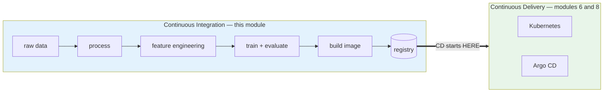
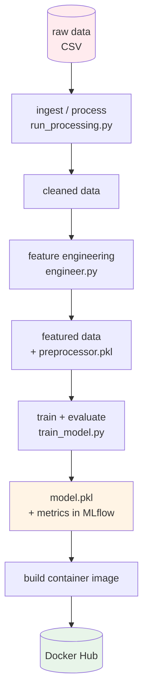
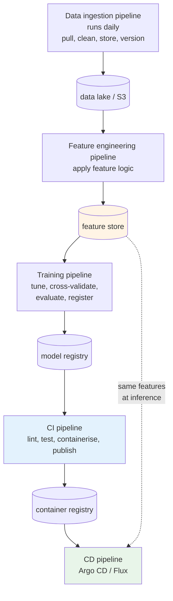
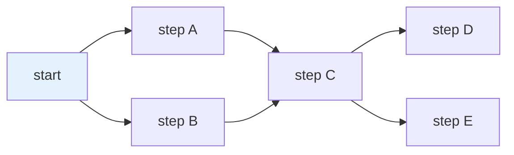
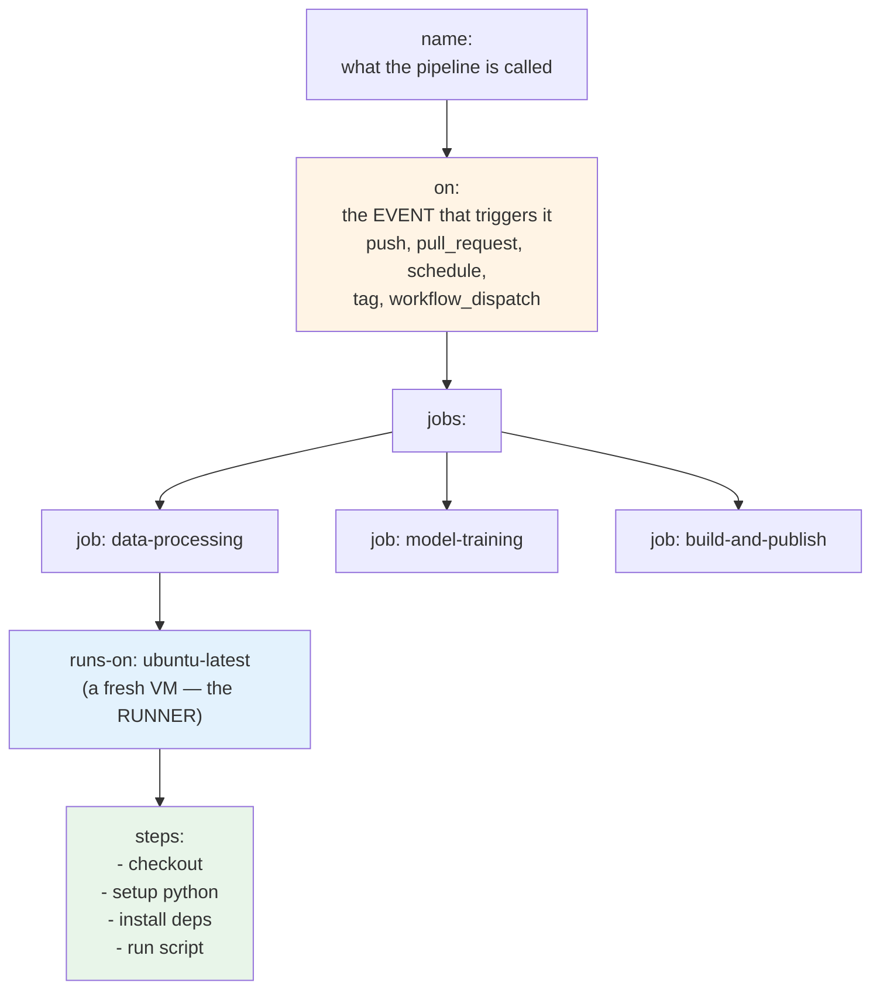
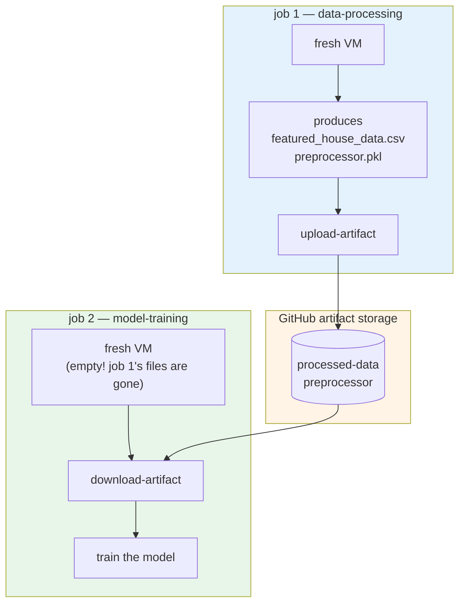
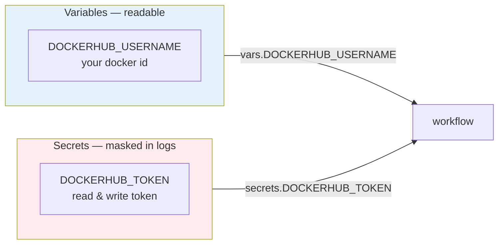
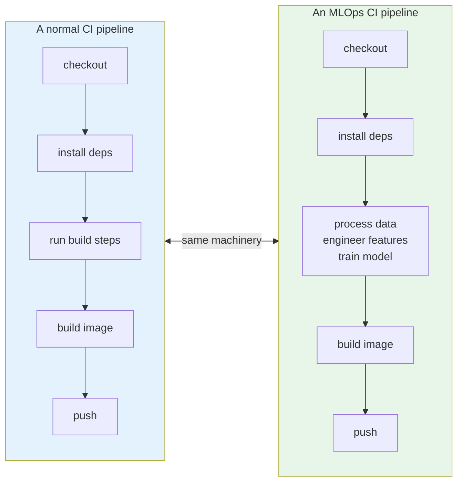

# Building an MLOps CI Pipeline with GitHub Actions

Ask yourself what you normally do once an application is containerised.

You set up a CI pipeline. Build, test, package, publish the image. Jenkins, GitHub Actions,
GitLab, whichever your team uses.

That instinct is correct here too. The steps are different, but the shape is the same, and so are
the tools. This module takes everything you have been running by hand since Module 3 and hands it
to a pipeline.

## What you'll learn

- Read GitHub Actions workflow syntax and explain triggers, jobs and steps
- Store registry credentials correctly as a variable and a secret
- Build a multi-stage pipeline where each job depends on the one before it
- Pass files between jobs using artifacts, since jobs share no filesystem
- Explain why an ML pipeline is an ordinary CI pipeline with a different payload

## First, let's call it what it is

You will see a lot of MLOps content describing what we are about to build as a "CI/CD pipeline".
It is not.



Continuous integration ends when the image lands in the registry. Continuous delivery is
everything after that, and it needs different tools, which you meet in Module 8.

So this is an **MLOps CI workflow**. Getting the names right is not pedantry. It tells you which
tool to reach for.

## The workflow you are automating

Nothing here is new. You have done every step by hand already.



The trigger is a push to your repository. The pipeline lives in the same repository as the code,
which means the pipeline is reviewed like code and changes with it.

:::note[A step we are skipping, and you should not]
Between training and packaging there should be a **model validation** step. Training already
produces scores such as R² and MAE. A validation step reads those and **fails the build** if the
model is worse than a threshold.

We keep it simple here and skip it. In real work, put it in. Without it, your pipeline will
happily package and publish a model that got worse.
:::

## One pipeline, or several?

We build one. Real organisations usually build several.



Why split them? **Reuse.** Feature engineering is needed during training and again during
serving. If it is its own pipeline, both can call it.

That dotted line is the important one. A **feature store** exists so the features used at
inference are the same ones used at training. When those two drift apart, your model is fed
something subtly different from what it learned on, and nobody notices. We do not use one in this
course, but you should know the name and the problem it solves.

Netflix, Airbnb and Spotify run hundreds of models with data arriving from many systems. At that
scale, separate pipelines are not an option, they are the only way it stays manageable.

## DAGs, and the tools that run them

Those boxes with arrows have a name. A **DAG**, which is nothing but a directed acyclic graph.



**Directed** means the arrows point one way. **Acyclic** means no loops, because a loop would run
forever. **Graph** is the shape. Some steps run in parallel, some wait for others.

Every pipeline tool you will meet is built on this idea:

| Tool | Where it fits |
|---|---|
| **Argo Workflows** | Kubernetes-native. Good if you are already on Kubernetes |
| **Kubeflow** | Kubernetes-native, ML-specific |
| **Apache Airflow** | General purpose. Good when you have more than Kubernetes |
| **Metaflow** | From Netflix. Pipelines written in Python rather than YAML |
| **GitHub Actions** | Simplest. Runs on GitHub's own machines, no infrastructure to set up |

Metaflow is worth a second look if your team is all Python and nobody wants to write YAML. Same
instinct that makes data scientists reach for Streamlit.

We pick **GitHub Actions** for one reason: anybody can run this course on any machine, with no
extra infrastructure at all.

## The anatomy of a workflow



**Events** decide when it runs. A push to `main`, a pull request, a tag, a schedule, or a manual
button via `workflow_dispatch`. That manual button is worth adding while you are still getting a
pipeline working.

**Jobs** are your stages. If you know Jenkins, a job is a stage.

**The runner** is the machine. `ubuntu-latest` gives you a fresh virtual machine that GitHub
throws away when the job ends.

**Steps** are the individual commands inside a job. A step either runs a shell command with `run`,
or borrows somebody else's prewritten action with `uses`.

## The thing that surprises people

Each job gets its **own fresh machine**. Nothing carries over.



Job two does not have the files job one created. That machine has already been destroyed. So
anything that needs to travel between jobs has to be uploaded and downloaded explicitly, as an
**artifact**.

`needs:` is what makes jobs run in order rather than all at once.

## Credentials, done properly

The pipeline has to log in to Docker Hub. You would never put a password in a YAML file, so you
use an access token and store it outside the code.

GitHub gives you two stores, and the difference matters:



:::warning[The mistake that produces a very confusing error]
Put the username in **Variables**, not Secrets. The workflow reads it as
`vars.DOCKERHUB_USERNAME`.

If you store it as a secret by mistake, `vars.DOCKERHUB_USERNAME` comes back empty and your image
tag becomes `docker.io//streamlit:latest`, with two slashes. The login step may even succeed. The
push fails with something unhelpful.
:::

## Start small

Do not write the three-job pipeline first. Write one job that does one thing, and get it green.

The Streamlit workflow is that starter. One job, builds one image, pushes it. It also shows a
useful trick:

```
on:
  push:
    paths:
      - 'streamlit_app/**'
```

**Path filters.** This workflow only runs when something under `streamlit_app/` changed. Editing a
notebook does not rebuild the web image. In a repository with several pipelines, this is what
stops every commit running everything.

Once that works, the credentials are proven and the full pipeline is just more of the same.

## Two details in the full pipeline

**MLflow is started and stopped inside the training job.** The job runs a tracking server in the
runner, uses it, and kills it at the end. The run history disappears with the machine.

That is fine for learning. In real work you would point `--mlflow-tracking-uri` at a permanent
server, so the history survives and you can compare this week's model against last month's.

**There is a wait loop before training starts:**

```
for i in {1..10}; do
  curl -f http://localhost:5000/health || sleep 5;
done
```

Starting a container and being able to talk to it are two different moments. Without this loop
the training step sometimes runs before MLflow is listening, and the job fails for no visible
reason.

Waiting for a service to become ready is something you will write many times in your career. It
is worth recognising the pattern.

## The point of the whole module



There is no special ML build system involved. It is checkout, install, run some steps, build an
image, push it. The only thing that makes it a machine learning pipeline is what the steps happen
to do.

If you already know CI, you already knew most of this module before it started.

## What you should have at the end

- a single-job workflow building and pushing the Streamlit image
- `DOCKERHUB_USERNAME` as a repository **variable**, `DOCKERHUB_TOKEN` as a **secret**
- a three-job pipeline: data processing, then training, then build and publish
- artifacts visibly moving between the jobs in the run summary
- a fresh image on Docker Hub that nobody built by hand

One thing is still unresolved, and it gets worse before it gets better. Every image is tagged
`latest`. When you deploy to Kubernetes in Module 6, nothing in the system will be able to tell
one build from another.

That problem comes due in Module 8, where it costs real debugging time. Module 9 fixes it
properly.
