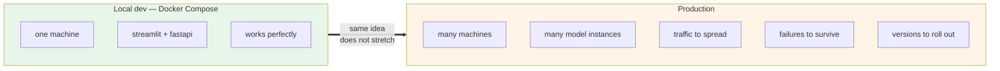
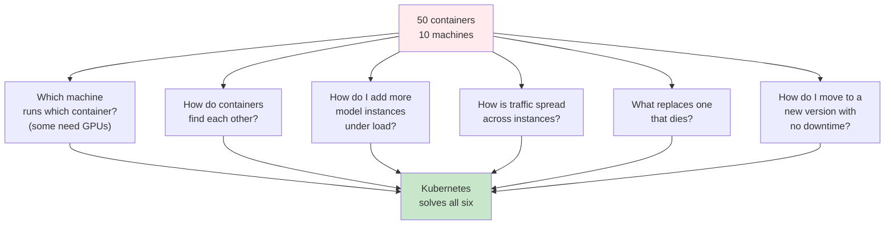
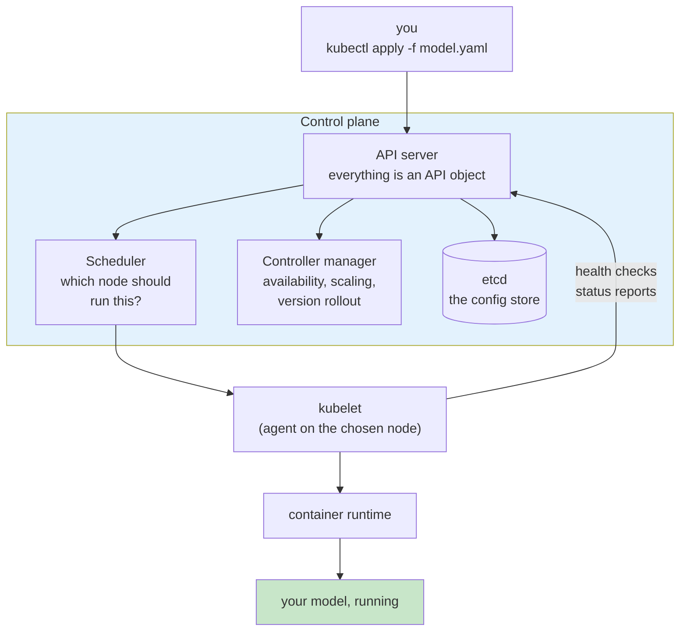
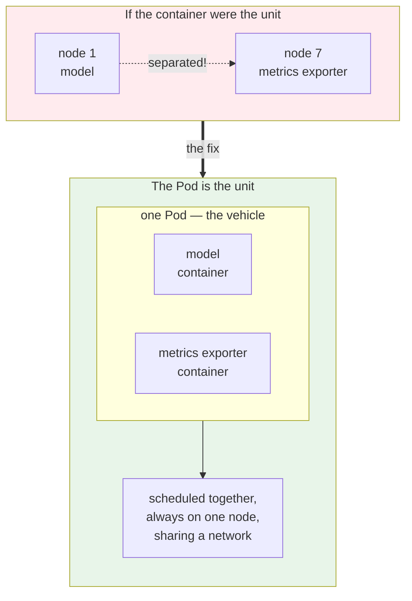
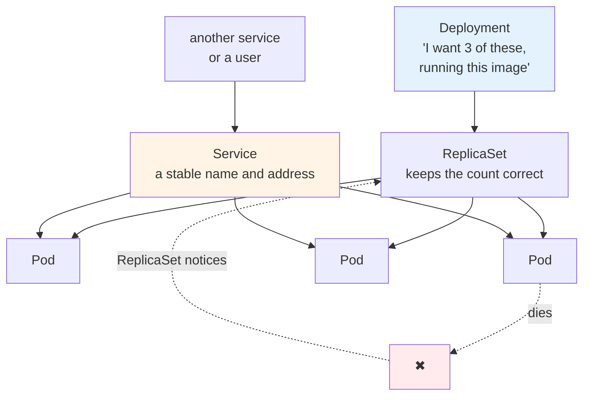
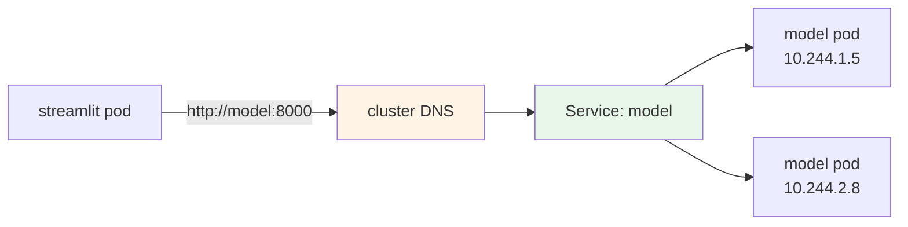
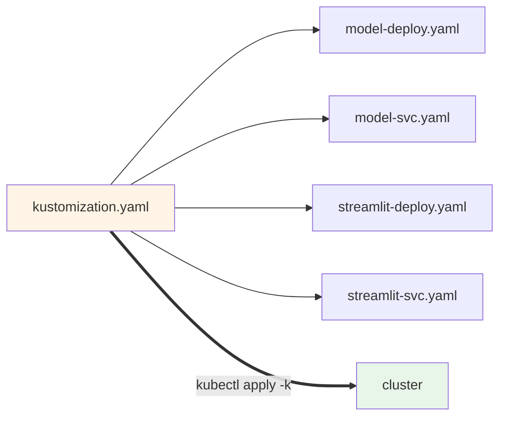

# Deploying the Model on Kubernetes

Your pipeline publishes an image to a registry. That image contains the model and the API around
it. So far so good.

Now somebody asks you to run it for real. Not on your laptop. For users.

This is the exact point where a lot of ML teams get stuck. Docker Compose works beautifully right
up until the moment you need more than one machine, and then it simply stops being the answer.

## What you'll learn

- Explain why model inference benefits from an orchestrator
- Use Pods, Deployments and Services correctly, and say what each one is for
- Build a three node KIND cluster and deploy both the model and the frontend
- Connect two services by DNS name rather than IP address
- Generate manifests instead of writing them, and manage them with kustomize

## The wall you hit after Compose



Containers gave you two genuinely valuable things. **A standard packaging format**, so the model
runs the same on your laptop, in a data centre or on a cloud. And **isolation**, so a specific
version of the model with its exact libraries stays separate from everything else.

Neither of those helps when you have fifty containers across ten machines.

## Six problems you would otherwise solve yourself



You could build all of that yourself. People did, for years. Kubernetes is the container
orchestration engine that gives it to you instead, and it has become the standard for cloud
native workloads.

For machine learning specifically it does more than run your inference. It becomes the platform
that the rest of the ecosystem sits on. Kubeflow, Argo Workflows, Argo CD, Seldon Core,
Prometheus. It supports GPUs. Your training workloads can run on it too.

:::note[This is not a toy pattern]
OpenAI serves an enormous number of inference requests a day on this kind of infrastructure. The
reason is the same as yours: scaling, load balancing, and connecting many backends together.

The scale differs. The primitives do not.
:::

## How Kubernetes is put together

You stop talking to individual servers. You join them into a cluster, put some managers in front,
and submit work to the cluster as one logical machine.



Five pieces worth knowing by name:

| Component | Its job |
|---|---|
| **API server** | Everything in Kubernetes is an API object. This is the front door |
| **Scheduler** | Decides which node runs your workload, based on its requirements |
| **Controller manager** | Delivers availability, scaling and rolling updates |
| **etcd** | Stores every object you create |
| **kubelet** | The agent on each node. Actually starts containers and reports health |

Follow the arrows once and the whole system makes sense. You submit a manifest to the API server.
The scheduler picks a node. The kubelet on that node starts the container and keeps reporting
back.

## A Pod, and why it is not just "a container"

In Kubernetes you do not deploy a container. You deploy a **Pod**.

That is why every validation command in this course looks at pods rather than containers.

A Pod is the unit of **deployment, replication, scaling and scheduling**. Most of your pods will
hold exactly one container, which makes the distinction feel pointless. Here is the case that
justifies it.

Say your model needs a small companion process alongside it. A metrics exporter, collecting
numbers from the model and shipping them to Prometheus. Good practice says keep them as separate
images, with separate concerns.

But they must run **together**, on the same machine. If the container were the unit of
scheduling, nothing stops one landing on server 3 and the other on server 7.



Think of the Pod as a vehicle. You put the model and its companion on the same vehicle, and it is
the **vehicle** that gets scheduled, replicated and scaled. Whatever is on it travels together.

## Deployments and Services

Two more objects and you have enough to deploy anything.



**A Deployment** is where you say what you want. This image, this many copies. It creates a
ReplicaSet, which does the actual counting. If a pod dies, a replacement appears within seconds,
and nobody had to be paged for it.

**A Service** gives you a stable name in front of a changing set of pods. Pods are disposable.
Every new one gets a new IP address. Without a Service, nothing could reliably talk to them. The
Service also spreads requests across whatever is behind it.

:::tip[The first thing to check when a Service does not work]
`kubectl describe svc <name>` and look at **Endpoints**.

If it lists pod IPs, the wiring is correct. If it says `<none>`, the Service's label selector
matches no pods, and nothing will ever reach it. That one line saves a lot of guessing.
:::

## Finding the model without knowing where it is

Your Streamlit app needs to call the model. It cannot hardcode an IP, because pod IPs change
constantly.



Kubernetes runs an internal DNS server. Name a Service `model`, and `http://model:8000` resolves
from anywhere in the cluster.

You have already met this idea. Under Compose it was `http://fastapi:8000`, resolved by Compose's
own DNS. Different platform, identical solution: name the thing, let the platform find it.

Because the Streamlit app reads its target from the `API_URL` environment variable, the **same
image** works in both places. That is the payoff for a decision made back in Module 4.

## Stop typing commands, start writing YAML

`kubectl create deployment` is fine for learning. It is a poor way to run anything real, because
the only record of what you did is your shell history.

You do not have to write the YAML by hand:

```
kubectl create deployment model --image=xxxxxx/house-price-model:latest \
  --port=8000 --dry-run=client -o yaml > model-deploy.yaml
```

`--dry-run=client` means do not send this to the cluster. `-o yaml` means print it instead.
Together they turn `kubectl` into a YAML generator.

Then **kustomize** groups the files so they apply as one unit:



Kustomize is built into `kubectl`, so there is nothing to install. It is an alternative to Helm,
and you will meet it again in Module 8, where Argo CD reads a kustomization directly, and in
Module 9, where overlays give you two environments from one set of files.

## Why KIND

You need a multi-node cluster, and you should not need a cloud account to get one.

**KIND** stands for Kubernetes in Docker. Each node is a container on your machine. You get a real
three-node cluster in a couple of minutes, for free.

:::warning[Remember what the nodes actually are]
Because the nodes are containers, images pulled by Kubernetes live **inside those containers**,
not in your laptop's Docker.

This has no consequence today. In Module 8 it produces a genuinely confusing bug, and knowing
this now is what lets you solve it then.
:::

## Deployment strategies, for later

Kubernetes gives you rolling updates out of the box. The ecosystem on top gives you a lot more:
A/B testing, canary, blue/green, shadow, challenger, multi-armed bandit.

Those matter more for models than for ordinary services, because a model can be perfectly healthy
and still be wrong. You will build that properly in Module 9. For now, know the words exist.

## What you should have at the end

- a three node KIND cluster, all nodes `Ready`
- the model and the frontend deployed, reachable on NodePorts
- the two connected by Service name, with no IP address anywhere
- generated manifests committed under `deployment/kubernetes`
- everything applying with a single `kubectl apply -k`

Before Module 7, try this. Scale a deployment with `kubectl scale`, then run `kubectl apply -k`
again. Your replica count is reverted.

Which is right, the cluster or the file in Git? Hold that question. It is the whole argument for
GitOps in Module 8.
