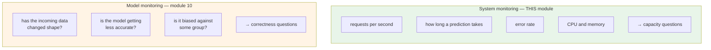
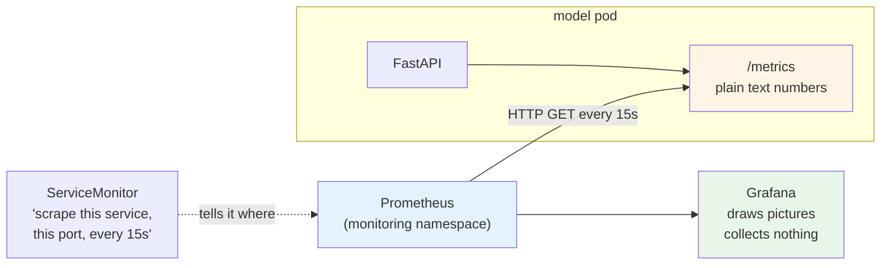
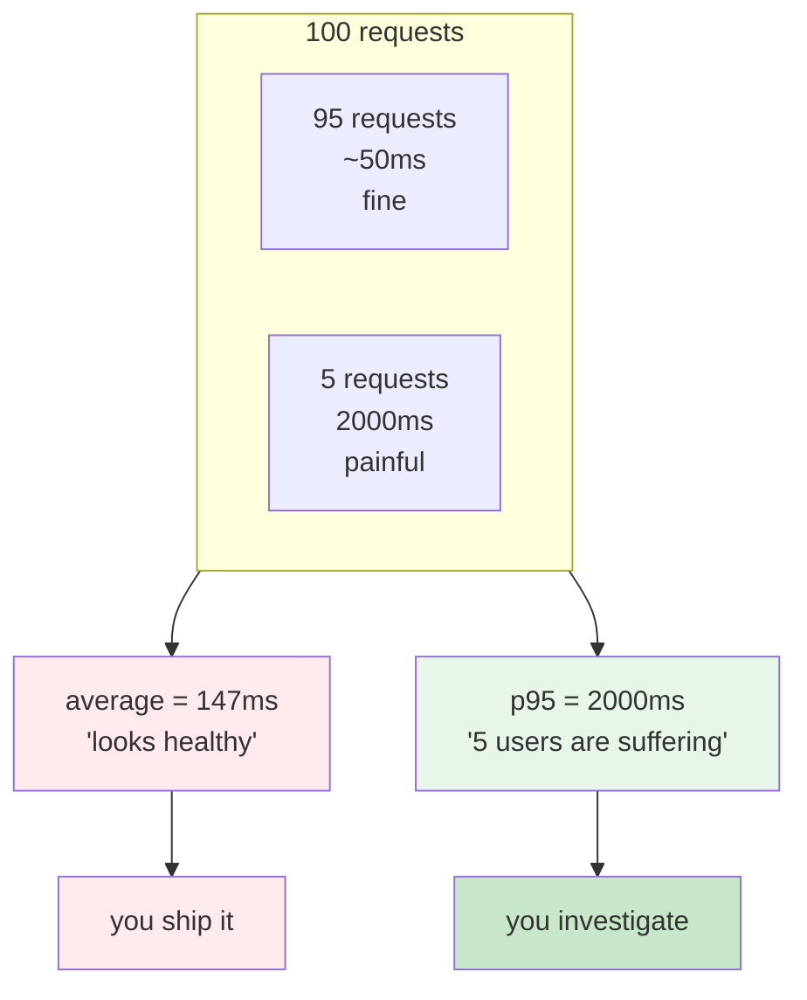
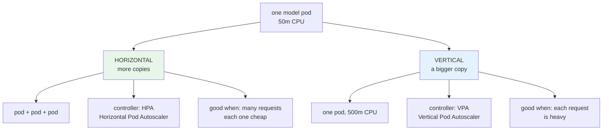
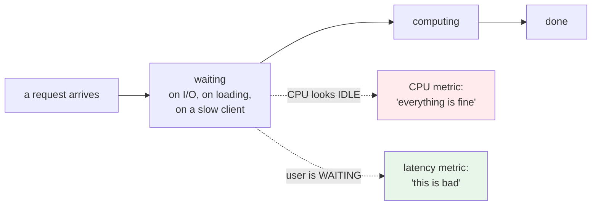
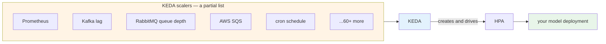
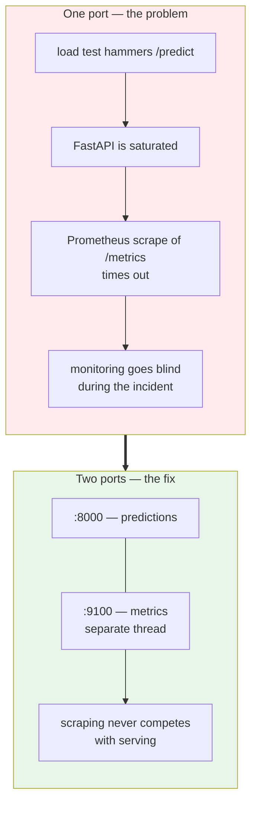

# Monitoring and Autoscaling Model Inference

Your model is running on Kubernetes as a single pod. Fixed size, one copy.

If prediction traffic doubles, that pod gets slower and nothing catches it. If traffic disappears
overnight, you keep paying for the same capacity. And right now, if somebody asks how many
predictions you served yesterday or how long each one took, you cannot answer.

This module fixes both, in that order. You cannot scale on a signal you are not collecting.

## What you'll learn

- Separate system monitoring from model monitoring, and say which this module covers
- Install Prometheus and Grafana with Helm, and instrument a FastAPI application
- Point Prometheus at your service with a ServiceMonitor, and verify data is arriving
- Explain why CPU is often the wrong scaling signal for model inference
- Scale on a Prometheus query with KEDA, and right-size pods with a VPA
- Run a load test and read the latency distribution rather than the average

## Two different things called "model monitoring"

Worth separating these before you build anything, because people use one phrase for both.

Here you treat the model as just another application that receives requests and has to keep up.
That is **capacity** monitoring, and it is what feeds the autoscaling later in this module.

Whether the model is still *right* is a completely different question, and it is Module 10.

## Prometheus pulls, your app does not push

Four things to take from that picture.

**Your application does not know Prometheus exists.** It publishes numbers at a URL. Something
else comes and reads them. That is the pull model, and it means you can add monitoring without
touching application logic.

**Prometheus does not scan the cluster** looking for things to scrape. You have to tell it. A
**ServiceMonitor** is how, and it is a custom resource the Prometheus operator installed for you.

**Grafana collects nothing.** It only draws what Prometheus already has. When a dashboard is
empty, the problem is almost always upstream of Grafana.

**Instrumenting FastAPI is two lines.** One wraps every route so timings and counts get recorded,
one exposes `/metrics`.

:::warning[Three fields decide whether a ServiceMonitor works, and all fail silently]
- `labels.release` must match your Helm release name. Prometheus only picks up ServiceMonitors
  carrying that label
- `selector.matchLabels` must match the labels on your Service
- `endpoints.port` must match the **port name**, not the number

Get any of them wrong and nothing happens. No error, no event. Just no data.

Always check `/targets` in Prometheus before you touch Grafana.
:::

## Four numbers worth having

| Metric | What it tells you | Why you care |
|---|---|---|
| **Request rate** | how much traffic | first thing to look at, obvious scaling signal |
| **p95 latency** | how slow the worst 5% are | what users actually feel |
| **Request size** | how heavy the inputs are | drives CPU and memory per pod |
| **Response size** | how much data goes back | network load, slow clients |

### Why the 95th percentile, not the average

An average hides a small number of very slow requests behind a large number of fast ones. Those
slow ones are the users who complain. The p95 is the number you would put in an SLO, and the
number you would scale on.

## Scaling in two directions

The names give the game away. HPA is the Horizontal Pod Autoscaler. It is in the name.

Horizontal is what you reach for first. More copies, each one able to fail without taking
everything down. Vertical helps when one request is genuinely expensive and no number of extra
copies makes an individual prediction faster.

## Why CPU is often the wrong signal

The default HPA watches CPU. For model serving that is frequently misleading.

A prediction can be waiting rather than computing. CPU stays calm while your users sit there.
Meanwhile latency, which is what they actually experience, has already gone bad.

So you would scale on the numbers you just built. Request rate and p95 latency. Those describe
the experience. CPU describes the machine.

Kubernetes cannot read a Prometheus query on its own. That is the gap KEDA fills.

## KEDA, and what makes it different

KEDA is Kubernetes Event Driven Autoscaling. Its strength is the breadth of things it can read
from, and those sources are called **scalers**.

You are using the Prometheus scaler. But the same mechanism scales on queue depth, on a schedule,
or on almost any external system. Worth knowing, because the next workload you scale may not be
an HTTP service at all.

KEDA does not replace the HPA. It creates one and feeds it. So after applying a ScaledObject you
will see an HPA you did not write. That is expected.

:::tip[Set resource requests first, or CPU scaling silently does nothing]
`Utilization: 50` means 50 percent **of the CPU you requested**. With no request declared, there
is no number to take a percentage of, and the trigger never fires.
:::

### Scale up fast, scale down slowly

`cooldownPeriod: 300` waits five minutes of calm before removing pods.

Scaling up should be quick, because users are waiting. Scaling down should be reluctant, because
traffic arrives in bursts and you do not want to drop capacity right before the next one.

## The failure that teaches the most

When you run the load test, you may see the Grafana graphs go blank. No data, exactly when you
most want it.

Predictions and metrics were being served by the same app on the same port. Under load the app is
busy answering `/predict`, so the scrape times out.

The fix is a second listener on port 9100, on its own thread, plus a Service port named `metrics`
and a ServiceMonitor pointing at it.

:::note[The general rule worth keeping]
Never let your monitoring path share a resource with the thing it monitors. It will go blind
exactly when you need it most.
:::

### On debugging this with AI

That problem was diagnosed with ChatGPT, and the method is worth copying more than the answer.

1. **Give it everything.** The scaled object, the ServiceMonitor, the Prometheus config, the
   graphs before and during
2. **Say what still works.** Scraping was fine at idle. That eliminates whole categories
3. **Correct it when you were wrong.** One piece of information turned out to be a
   misreading of the wrong metric. Saying so moved the conversation forward
4. **Know where its context ends.** It could not suggest the Dockerfile change to expose 9100,
   because it had never seen the Dockerfile. That part was still yours

AI narrowed a search space. It did not hand over an answer.

## What you should have at the end

- Prometheus and Grafana installed by Helm, both reachable
- the FastAPI app publishing `/metrics`, with a ServiceMonitor scraping it
- your model target showing `UP` in Prometheus
- a dashboard showing request rate, p95 latency, and sizes
- KEDA scaling the model on latency and request rate
- a VPA recommending pod sizes
- a load test you have actually run, with the replica count moving and coming back down

You now know how many requests your model gets and how long they take, and it adjusts its own
capacity.

Every change still reaches the cluster because you typed `kubectl apply`. Module 8 takes that last
manual step away.
