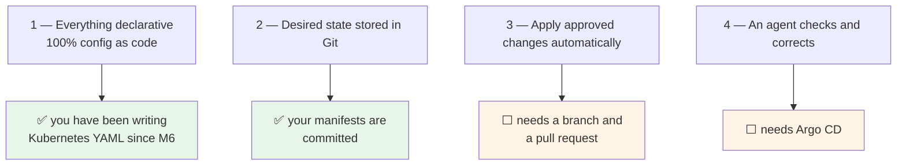
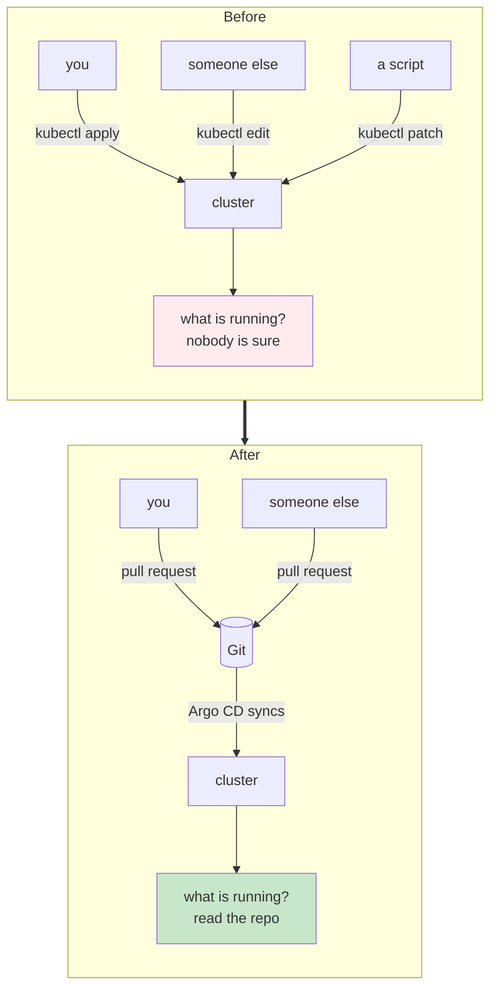
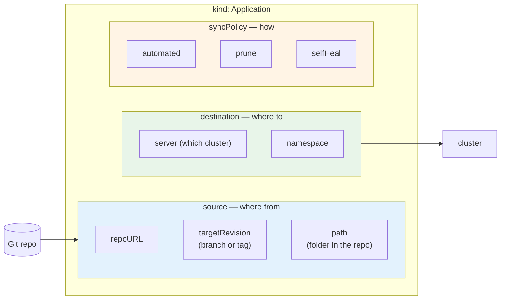
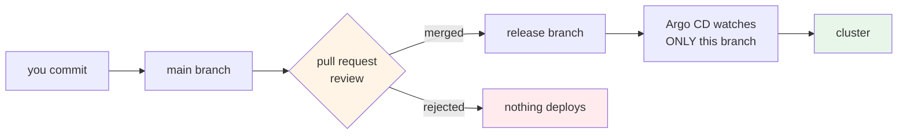
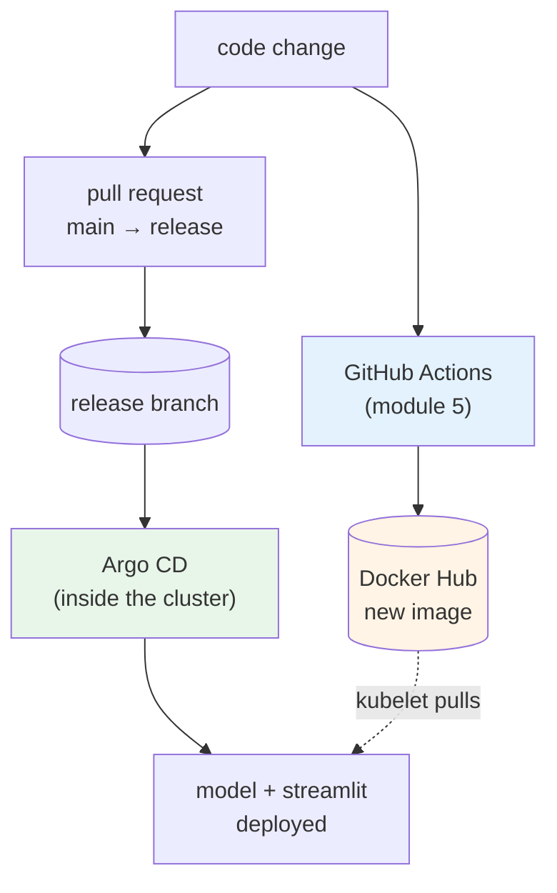
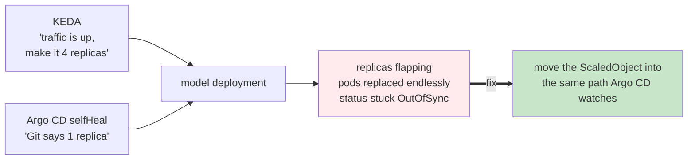
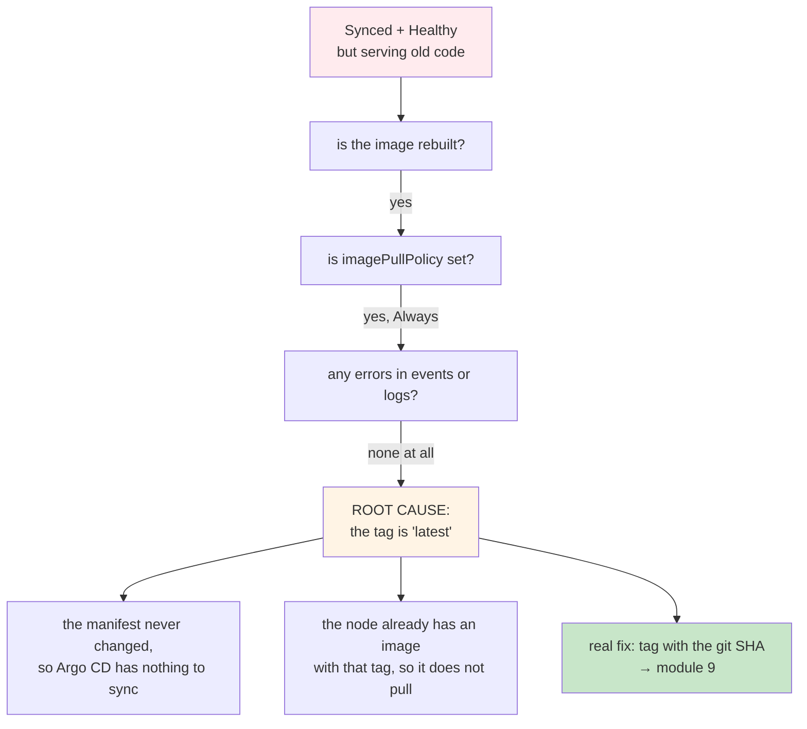

# Continuous Delivery with GitOps and Argo CD

Every change to your cluster so far has happened because you ran `kubectl apply`.

That works while it is only you. It stops working the moment there are three of you, because now
the cluster's state depends on who ran what and when. Nobody can say with certainty what is
running, or why.

In this module you hand that job to an agent inside the cluster. You push to Git, and it deploys.

## What you'll learn

- State the four principles of GitOps and map each to something you already built
- Install Argo CD into the cluster that runs the model
- Write an Application resource mapping a Git repository to a cluster
- Use a release branch and a pull request as the approval step
- Take a change from a code edit to a running pod without running `kubectl apply`
- Debug a deployment that reports Synced while still serving the old version

## Where GitOps came from

Around 2017, Kubernetes became popular enough that teams needed a repeatable way to do continuous
delivery on it. Out of that came four principles. They are guidelines rather than a product, and
you have already done most of them without using the name.

Principle four is the one that changes how the system behaves. **Check and correct, continuously.**
Not "apply once and hope", but an agent that keeps comparing what is running against what Git
says, forever.

:::note[GitOps is bigger than Kubernetes]
The same four principles apply to infrastructure as code, with tools like Terraform and Atlantis.
Here we use them in the Kubernetes context, because that is where your model runs.
:::

## What actually changes

This reassigns the roles of your tools:

- **Git** is for change
- **Argo CD** is the enforcer
- **`kubectl`** is for inspection and debugging only

That last one takes a while to feel natural. You will reach for `kubectl edit` out of habit, and
`selfHeal` will quietly undo it.

## The Argo family, and which one you want

| Tool | What it does |
|---|---|
| **Argo CD** | continuous delivery by GitOps. **This module** |
| **Argo Rollouts** | progressive delivery, blue/green and canary. Module 9 |
| **Argo Workflows** | pipelines as DAGs on Kubernetes |
| **Argo Events** | event-driven triggers |

Argo CD is simple to start with, comes with a usable web interface, and lets you do this step by
step before codifying everything. You can drive it entirely from YAML later.

## The Application, which is a custom resource

Argo CD adds a new object type to your cluster called an **Application**.

It is not built into Kubernetes. It is a **custom resource**, which is nothing but a way of
extending Kubernetes with new kinds of objects, plus a controller that understands them.

You have already used one without noticing. The `ScaledObject` from Module 7 was brought in by
KEDA in exactly the same way. So was `ServiceMonitor`, by Prometheus.

Strip away the detail and an Application is one mapping: **this folder, on this branch, in this
repo, belongs in this namespace, on this cluster.**

The three sync policy options are worth knowing precisely:

- **automated** — sync when the branch changes, without being asked
- **prune** — delete objects from the cluster when they are removed from Git
- **selfHeal** — undo changes made directly on the cluster

:::tip[Names must be lowercase]
Kubernetes object names have to be valid subdomain names. `House Price Predictor` is rejected
with a message about lowercase subdomains. Use `house-price-ml`.
:::

## The approval step

Principle three said *approved* changes. That word is doing real work.

Two branches. `main` is where work happens. `release` is what the cluster runs. Argo CD watches
`release` and nothing else.

So a change reaches production only when somebody opens a pull request and it gets merged. This is
a habit developers have used for years, borrowed and pointed at deployments.

## The whole picture

The two halves finally meet. **CI builds the artifact. CD deploys the manifest.** Neither one
touches the cluster directly except Argo CD, which lives inside it.

## When the two autoscalers disagree

If your KEDA `ScaledObject` sits outside the path Argo CD watches, you get a fight.

Each controller is doing its job correctly. The problem is that they are working from different
sources of truth. Bring the ScaledObject under the same kustomization and they agree.

:::note[A general rule, not a quirk]
Any controller that mutates something Argo CD manages will fight `selfHeal` until it is part of
the same source of truth. You will meet this again with Argo Rollouts in Module 9.
:::

## The bug that costs everyone an afternoon

Argo CD says `Synced`. The pod is `Running`. Docker Hub has a new image. The browser shows the
old version.

A mutable tag breaks the whole chain. Because `latest` never changes, the YAML is byte for byte
identical between releases. Argo CD compares Git to the cluster, finds no difference, and
correctly does nothing. Meanwhile the node already has something tagged `latest`, so it sees no
reason to pull.

There is a workaround on KIND, involving `crictl` on the nodes, and the lab walks you through it
because the debugging itself is instructive. But it is a workaround.

:::warning[The real fix is a unique tag per build]
Tag images with the Git commit SHA. Then every build produces a tag that never existed before,
the manifest genuinely changes, Argo CD has something real to sync, and rollback becomes
deterministic.

You do this properly in Module 9.
:::

## What you should have at the end

- Argo CD running in its own namespace, with the UI reachable
- a `release` branch, and a pull request as the gate in front of it
- an Application mapping `deployment/kubernetes` on `release` to the `default` namespace
- the model and frontend recreated by Argo CD, not by you
- a change taken end to end: edit, CI build, pull request, merge, automatic deploy
- a manual `kubectl scale` reverted by `selfHeal`, watched with your own eyes

That last one is the moment it clicks. The cluster is no longer something you edit.

Everything so far protects you from a *broken* deployment. Nothing yet protects you from a
deployment that is perfectly healthy and quietly wrong, which is exactly how models fail. That is
Module 9.
