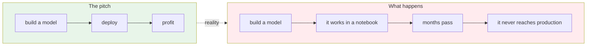
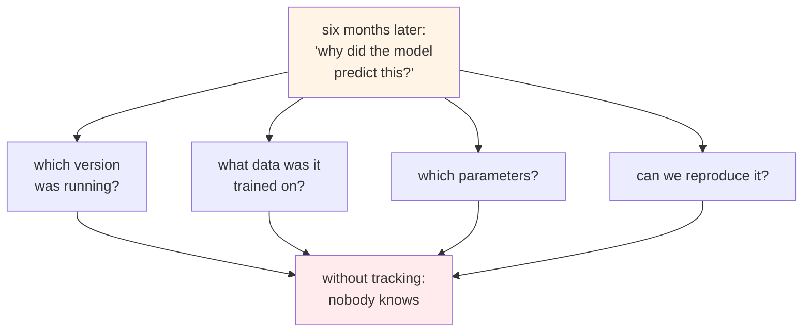
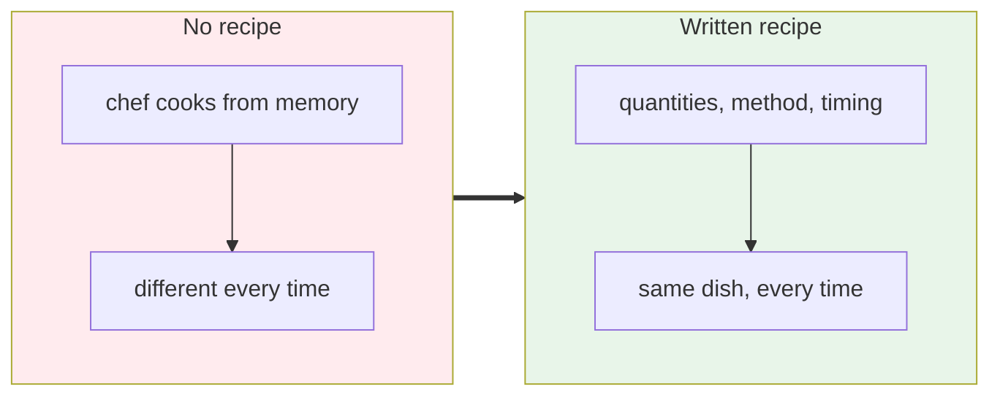
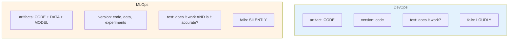
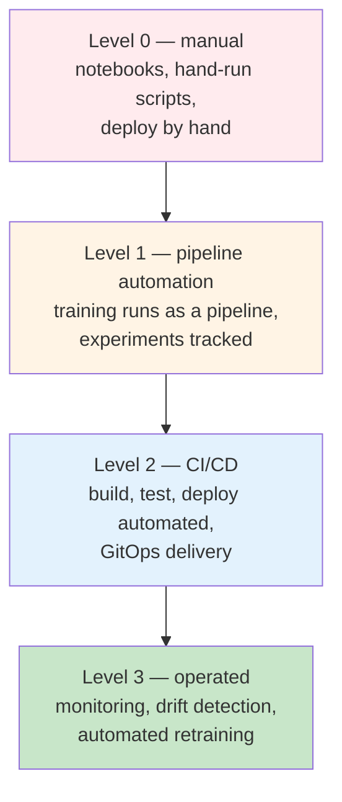
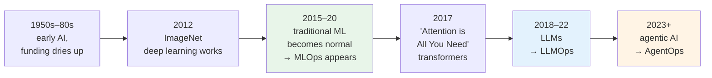
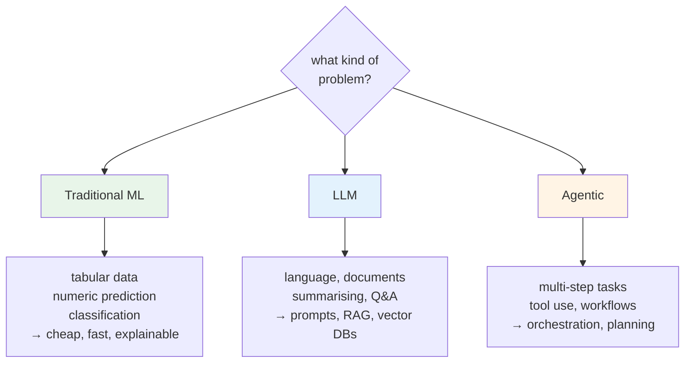
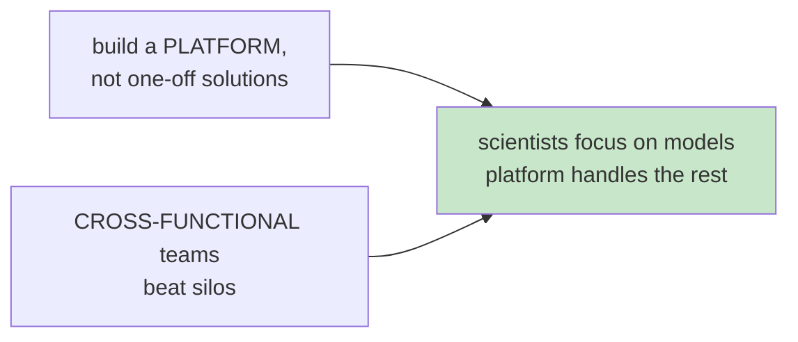

# MLOps Foundations and Context

Optional module. Nothing in the project depends on it.

This is the background. What MLOps is, how it differs from the DevOps you already do, where it
came from, and how companies actually run it at scale. Read it before Module 1 if you like context
first, or after Module 8 when you have something to hang it on.

## What MLOps is, and the problem it solves

The optimistic version of machine learning goes like this. You build a model, you train it, you
deploy it, and profit follows.

Enormous amounts of money go into machine learning, and a large share of models never reach
production at all. Not because the models are bad. Because the path from a notebook to a running
service was never built.

MLOps is **a set of practices**, not a job title and not a tool. The aim is to automate, deploy and
maintain ML systems so they are production ready and reproducible.

### What actually breaks without it

That is why experiment tracking exists, and why you set up MLflow in Module 2 before training
anything.

### The restaurant analogy

Imagine a restaurant you loved. You go back a month later and the same dish tastes completely
different. A different chef made it, working from memory.

A good restaurant writes the recipe down. Quantities, method, timings. Then any trained chef
produces the same dish.

MLOps is writing the recipe down. Which data, which features, which algorithm, which parameters,
which version. Then the result is reproducible instead of lucky.

## MLOps versus DevOps

You already know DevOps. Plan, code, build, test, deploy, repeat. So how much transfers?

Most of it. What changes is **what you are versioning and what you are testing**.

Three artifacts instead of one. That is the whole difference, and everything else follows from it.

| | DevOps | MLOps |
|---|---|---|
| What you version | source code | code, **data**, **experiments**, **models** |
| Build input | source code | source code **and data** |
| Testing | unit, integration | plus model accuracy, data validation |
| Deployed thing | a service | a **serving / inference** service |
| Failure mode | crashes, errors | **silently wrong predictions** |
| Retraining | not a concept | a first-class pipeline |

### Same shape, different tools

Most of your toolbox carries over unchanged.

| Job | DevOps | MLOps adds |
|---|---|---|
| Version control | Git | Git, plus DVC for data |
| CI | Jenkins, GitHub Actions | same |
| Experiments | — | **MLflow, Weights & Biases** |
| Pipelines | Jenkins, GH Actions | Argo Workflows, Kubeflow, Airflow, Metaflow |
| Deploy | Kubernetes, Argo CD | same |
| Serving | your app | **KServe, Seldon Core, BentoML, TF Serving** |
| Monitoring | Prometheus, Grafana | same, plus **drift detection** |

The rows that are new are the rows where the extra artifacts show up. Everything else is your
existing job.

:::note[Which is why this transition is a real career path]
If you already do DevOps, you are the expert on containers, CI, Kubernetes and monitoring. Those
are most of the boxes. What you are adding is a handful of new ideas, not a new profession.

The role is often called MLOps engineer, or increasingly **AI platform engineer**, since the same
person ends up supporting ML, LLM and agent workloads.
:::

## The maturity ladder

Nobody arrives at the top. You climb.

This course walks that ladder. Modules 2 and 3 are level 0. Module 5 is level 1. Modules 6 to 8
are level 2. Modules 9 and 10 are level 3.

Most organisations sit at level 0 or 1 and believe they are at 2.

## How we got here

Two things drove it. Cheaper compute, especially GPUs. And far more available data.

Once companies had models that mattered commercially, the operational problem appeared, and MLOps
was the answer to it.

## ML, LLM and agentic — picking between them

A common misunderstanding is that each generation replaces the last.

:::warning[It's not like that]
They build on top of one another. Traditional ML is not going away, and plenty of problems are
solved better and far more cheaply by it than by a language model.

There is no one solution to your problem.
:::

Their operational concerns differ too:

| | MLOps | LLMOps | AgentOps |
|---|---|---|---|
| You train | yes | rarely, mostly prompting | no |
| Core work | pipelines, retraining | prompts, RAG, vector DBs | tools, planning, orchestration |
| Main worry | drift, accuracy | hallucination, token cost | tool failures, loops, cost |
| Evaluation | R², MAE, F1 | groundedness, eval sets | task completion |

Do not try to solve every problem with the newest thing. Predicting a house price with a language
model would be slower, more expensive and less accurate than the regression you build in this
course.

## How real companies do it

**Netflix** had data scientists spending their time on infrastructure rather than models. They
built **Metaflow**, giving a Python interface to workflows so scientists stayed in Python and the
platform handled the rest.

**Uber** had teams solving the same problems repeatedly with no shared platform. They built
**Michelangelo**, one central ML platform covering the lifecycle end to end. Faster iteration,
less time to production.

**OpenAI** operates models at enormous inference scale on this same class of infrastructure,
dealing with accuracy, hallucination and cost.

Two patterns run through all three:

:::tip[Start small]
None of these companies began with a platform. They began with one pipeline, one model, one
problem.

Start with something simple. Automate one step. Then the next. That is exactly what this course
does.
:::

## Where to go from here

If you have not started the project yet, Module 1 gives you the map and Module 2 sets up your
machine.

If you have finished Module 8, the natural next step is Modules 9 and 10, where the practices on
this page stop being background and become a working control loop.
